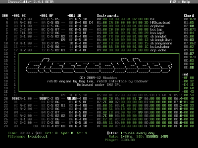

*The Popular Editor*

[README](README.md) | [EDITOR](editor.md) | [ABOUT](about.md) | [CHANGELOG](CHANGELOG.md)

# About

CheeseCutter is a tracker program for composing music for the [SID](http://en.wikipedia.org/wiki/MOS_Technology_SID) chip. 
It uses the reSID engine for SID emulation. The packed files can be played on a real C64.

The first release, what I now call the "0-series" was aiming for JCH Editor
compatibility. Most JCH Editor files are compatible with this editor, so there
was a large stock of music already composed "for it", which may have
helped to attract experienced users.

The new "2-series", although similar on the surface, is a totally different beast.
Nearly all parts of the program have been overhauled. JCH
compatibility is gone.  Featurewise it's now pretty close to top of
the line SID music editors such as GoatTracker 2 and Sid Duzz'It.

## Summary of differences between CheeseCutter 0.x and 2.x

* Support for up to 32 subtunes, 48 instruments and 128 sequences.
* Multispeed support.
* Instruments can have descriptions (try pressing <kbd>Enter</kbd> in the instrument table).
* Separate wrap marker and start marker. 
* Sequences have 3 columns instead of 2. This means you can have an instrument setting and a command on the same sequence row. "Tie note" is no longer a command ('***' as it used to be) but is entered in the note column by pressing the note key shifted. Tied notes are displayed in purple background color in the sequencer.
* By default, when you enter a note, the corresponding instrument value is also set in the second column. The active instrument can be selected with <kbd>Keypad +</kbd> and <kbd>Keypad -</kbd>. The selected instrument can be seen highlighted in the instrument table. You can toggle this feature on and off with the semicolon key.
* More sophisticated player/editor integration - closer to SID Factory (though still lacking in features).
* <kbd>F3</kbd> starts playing the song from wherever the cursor happens to be in the sequencer; previously it was only possible to play from the beginning of the tune or the beginning of the sequence.
* Track transposing now uses signed values so you can transpose both in negative and positive direction, with A0 being the center value; this works similarily to SDI. Transpose value 80 uses whatever value was previously set in the track.
* No JCH's editor-style +++ / --- in note column to indicate the gate bit status - uses the modern way of toggling the gate value with separate commands in the note column. 
Works mostly like in GT2. Pressing <kbd>1</kbd> in the note column enters the gate off command; <kbd>!</kbd> or <kbd>a</kbd> enters the gate on command.
* <kbd>Ctrl-T</kbd> in the sequencer allows you to toggle between displaying and editing the notes independent of transpose value, like in JCH's editor, or relative to current transpose value, like in SDI.
* <kbd>Ctrl-R</kbd> in the sequencer allows you to display/hide the individual row counters for sequences.
* The currently used SID model and filter preset (if resid-FP is used) are saved in the song header and restored when you load the tune.
* Song data is packed and with a new recommended file extension (.ct), though not enforced in the program.

## Summary of features in the new player

* Has almost all the features of NP21.B6 (the B stands for booty, by the way), which was based on Laxity's NP21.G5, and dozens more. The downside of this is yet additional memory and rastertime use. To save a couple of bytes and scanlines, you can easily flag out any unused effect code if you're willing to assemble your final tune from a source dump. A tool to pack and dump your worktunes to source code is included in the distribution.
* Many commands accessible directly from a sequence so the *Command table* (or Super Table as it's called in JCH's editor) is not used nearly as much as it used to be. This reduces the amount of extra tinkering.
* The command table is 3 bytes wide instead of 2, with the 1st byte simply denoting the command to be used. (Note that only 4 lowest bits are displayed, e.g. 0-F)
* All filter settings can only be controlled from the filter table. This allows more flexibility but also slightly more work on the user's part.
* As it used to be, the first 2 bytes in the *Command table* are the hard restart values. (the first "value bytes" in the command table that is...). Chord program 0 is used as a swing tempo program when it has been enabled by setting the song speed to 0 or 1. 
* Unfortunately it is not possible to change the wave table pointer from a sequence or the command table. However, the newly added chord table diminishes the need for such feature.

## Known bugs and missing features

### Editor

* Multispeed playback doesn't work well past 4x.
* No drive selection in the file selector.
* Some crashes related to unicode handling. Mostly concerns the file selector, so watch out when you change to a dir with lots of weirdly named files.
* Importing misses some parameters such as the sid model and default subtune speeds. 
* NTSC support incomplete, untested etc. If anyone actually still makes NTSC tunes, let me know. 
* 1024x768 resolution very buggy. (REMOVED since 2.4.0)
* Make sure you set the playback mark on place where the tracks are aligned - starting at the same row. Otherwise the editor will misalign the tracks when starting playback in followplay mode with <kbd>Shift</kbd>-<kbd>F1</kbd>. If you get yourself into this state, the sequencer can always be reset with <kbd>Ctrl</kbd>-<kbd>L</kbd>, which should restore correct alignment. <kbd>F3</kbd> should work without problems since you can start playback with it from any position, so it's advisable to use it. <kbd>F1</kbd> and mark setting behavior is due to improve in some future version.

### Packer

* <b>-s</b> and <b>-c</b> parameters don't actually do anything yet. 
* Perhaps an option to use non-vsynced player timing for finer tempo control. 

### Player

* Issuing a portamento resets an ongoing slide.
* Slide, vibrato &amp; portamento commands can't be started on the same row with a tied note.
* Changing between swing tempo and regular tempo mid-song can mess the timing.

## Screenshots & videos

Screenshot.

* [Youtube video of CheeseCutter 0.4 playing DRAX's brilliant "Swamp Poo"](http://www.youtube.com/embed/MBpAb0kM-M8)
* [Youtube video of CheeseCutter 0.4 playing Mitch & Dane's "Dazzler"](http://www.youtube.com/embed/w9gUmahnR4Y) (Warning: low quality video)

## Credits

* Programmed by abaddon + contributors in 2009-2013.
* reSID engine by Dag Lem &amp; Antti Lankila.
* Some parts of the reSID interface taken from GoatTracker by Cadaver / CovertBitops.
* Music player based on NP21.G4 by Laxity / Vibrants / MoN.
* Ascii logo by iLKke / pm.
* Special thanks to Vent / Triad, Blackspawn, Scarzix / Offence, Ruk / Triad, Wisdom / Crescent for their assistance; to Cadaver for authoring GoatTracker, Geir &amp; GRG of Shape for authoring SDI, and Laxity and JCH for their editors which were the main sources of inspiration for this program.

The program is licensed under GPL General Public License.
