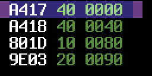
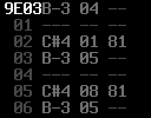
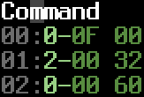
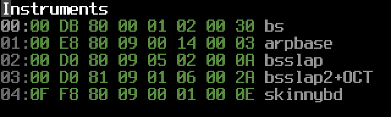
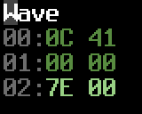
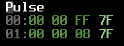
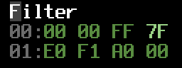
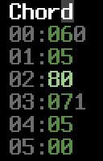

# Guide

*The Popular Editor*

# Table of Contents

* General tips
* FAQ
* The default player documentation
  * Tracklist
  * Sequence format
  * Command column values
  * Command table
  * Instrument table
  * Wave table
  * Pulse table
  * Filter table
  * Chord table
  * Miscellaneous
* SID Cheat Sheet
  * Links

## General tips

* Keep sequence 00 empty as it's currently reserved to be used as a dummy sequence. Start your tune from seq 01 and upwards. You can use it too if you insist but it's bound to cause some headache.
* Use subtunes for developing different parts of the tune and combine them to a finished piece in a single tune in the end.
* Make sure you set the playback mark (the blue bar, set with **Backspace**) on a location where the tracks are aligned - starting at the same row.
Otherwise the editor will misalign the tracks when starting playback with F1. If you get yourself into this state, the sequencer can always be reset with **Ctrl-L** which should restore correct alignment.
F3 should work without problems since you can start playback with it from any position, so it's advisable to use it. F1 and mark setting behavior is due to improve in some future version.

I realize the occasional need for resetting could be considered a design flaw. Most JCH-styled editors actually have the same problem, and it's relatively easy to correct by the user so 
I'm not planning to do much about it soon.

The above applies also to when setting a wrap point (the purple bar, **Ctrl-Backspace**). You should only wrap back to position where tracks are aligned.

* Somewhat related to above - when you start a tune, keep the lengths of your voices aligned, if possible, even if it means you'll be repeating a lot
of data (for instance making several 64 row sequences of a bassline with only minor changes).
This way you'll have much easier time editing the tune. When your composition is finished, you can start splitting sequences up 
and eliminate the repetition.

* Packer considers a subtune "unused" if all voices have a single trackvalue of A000 in the tracklist. This is important to know because you might else get unwanted testtunes included with your exported sid.

## FAQ

*How do I convert my tune to .sid?*

Use the command line tool (ct2util) which came with the zip/tarball. 

Example: 

```
ct2util sid mytune.ct mytune.sid
```

With the JCH compatible version (0.5.x) you're stuck to using the JCH editor's NP-Packer. You can find it in <a href="http://csdb.dk/release/?id=20112">CSDb</a>.

* I can't use the fullscreen / the picture is too small.

Try the YUV video mode (launch ccutter with parameter *-y* or *-ya*).

* The editor drains the battery on my laptop.

Use the old reSID emulation, and if necessary, drop the sampling rate (commandline parameter *-nofp* for old reSID, and *-r [value]* for sample rate).

* 
What are the advantages over GoatTracker?

It's mostly a matter of taste. Some (like myself) may find the JCH-like environment more comfortable than GoatTracker's. The player is more rastertime-heavy but I chose features/comfort over speed. There is a tiny 
player in development which is aiming to reduce the rastertime and memory use with the price of some comfort. 

## The default player documentation

**Warning: this doc is slightly inaccurate.**

### Tracklist

First column is the Transpose value of the sequence and the sequence number. 
Second column is the length of the sequence. Third column indicates the overall position in the song, basically 
summing up the sequence lengths.



* Transpose value is now a signed number with value A0 corresponding zero, A1 transposing by +1, 9F transposing by -1 etc.
* Transpose value 80 is a skip value meaning the player will use whatever transpose was previously given in the tracklist.
* The warp point (the purple bar visible in tracklist) can be set with **Ctrl-Backspace** from the editor. It's the point where the song playback returns to when its end is reached.
* The playback start point (the blue bar) can be set with **Backspace**. Affects F1-key.

### Sequence format

Sequences generally look like this:



A single row in a sequence looks like this:


The first column above is obviously the note, second is an instrument value and third is an optional command value.

### Command column values

These are what you can enter into sequences.

* `01-3F` Execute a command from the Command Table (see below for details on possible commands.)
* `40-5F` Changes the pulse table pointer for the currently playing note. Will be overwritten with the default value from the instrument table when the next note comes up (unless the instrument doesn't define a pulse pointer).
* `60-7F` Change the filter table pointer. Works similarily to the pulse table change.
* `80-9F` Activates a "chord" from the Chord Table.

The chord values are read in tandem with the Wave Table (meaning that the wave delay value also affects the chord) and added to the base note. You can apply a chord
over any kind of wave table program except that absolute note values (80-DF) are not affected.

The Chord Table is indexed, meaning that the value entered into the Command column does not directly point to the Chord Table but to an index which holds the beginning point of each chord program.
Values `40-7F` are considered negative transpose values, with `7F` equaling to -1, `7E` equaling to -2 etc.

* `A0-AF` Sets the Attack envelope value for the currently playing note.
* `B0-BF` Works similarily for Decay.
* `C0-CF` Works similarily for Sustain.
* `D0-DF` Works similarily for Release.
* `E0-EF` Sets the global volume.
* `F0-FF` Sets the song speed; values 0 or 1 enable the swing tempo. The first set in the Chord Table defines the swing program.

### Command table



Byte A is the command number (see below). Bytes B & C are the parameter values.

* 0 - Slide up
* 1 - Slide down
* 2 - Vibrato. This is the usual delta vibrato as found in JCH's players from 20.G4 upwards. You probably know
how to use it. Try values `2-00 32` and `2-00 43` for starters.
* 3 - Detune the currently playing note. It's a 16 bit value so the whole frequency range is available.
* 4 - Set ADSR for the current note.
* 5 - Lowfi vibrato. Byte A: Speed, byte B: Depth.
* 6 - Set waveform. Byte B: new waveform value. Works only when the current instrumtent's wave program is now changing the waveforms.
* 7 - Portamento. This is a bit tricky to use. Due to current implementation you must activate the portamento BEFORE 
the note(s) you wish to portamento to. Issuing the command in the same row with a note applies the portamento only
on notes following that. ~~(You can use it only on tied notes. When a regular note is encountered the portamento command is shut down. This behavior might be changed in the future.)~~
* 8 - Stop slide or portamento. Does not take any parameters.

### Instrument table



*  Byte A / B: ADSR
*  Byte C: Hardrestart type & Wave program delay value
Works mostly as in NP21.G5.
* Low nibble (x0-xF): Wave program delay value.
* 0x: Note restart type 1: Gate off three frames before next note. Waveform cleared one frame before next note.
* 4x: Soft restart. Gate off two frames before next note.
* 8x: Regular hard restart.
Gate off & write hard restart value to ADSR two frames before next note.
The current instrument's byte D is written to waveform register.
* Ax: Laxity restart. Works like 8x except the AD part of the volume envelope is not touched.
Restart types 0x and 8x are the ones to use for most of the time.
4x (soft restart) usually works best (least buggy) with big (>= 8) release values.
* Byte D: Hardrestart waveform
Used when Byte C (Hardrestart type) = 8x or Ax. The value is written into SID waveform register 1 frame before next note.
Usually values 0 & 8 are the most useful. The gate bit is automatically set by the player, so it does not make a difference if you type e.g. 00 or 01.
* Byte E: Filter table program. 00 = no filter; the voice keeps playing any filter program set by another instrument or sequence command.
* Byte F: Pulse table program. 00 = no pulse; the voice keeps playing any pulse program set by another instrument or sequence command.
* Byte G: Unused.
* Byte H: Wave table pointer.

### Wave table



Works mostly like it did in JCH's editor.

* The transpose column (byte A):
  * `00-5F` - Regular transpose values.
  * `80-DF` - Absolute transpose values (unaffected by note or any other transpose value)
  * `7E` - Stop, the wave program stays in the previous row
  * `7F` - Wrap, byte B defines the wrap point
* The waveform column (byte B):
* `00` - Does nothing (keeps the previously set waveform).
* `01-0F` - Overrides the instrument's Wave Delay value for the previous row. Also affects the chord program if one has been enabled. 
* `10-DF` - SID waveform values.
* `E0-EF` - SID waveform values `00-0F`.

### Pulse table



* Duration (byte A). Works like byte C in JCH's players.
* `00-7F` Duration with positive add value.
* `80-FF` Duration with negative add value.
* Add value (byte B). Works like byte B in JCH's players. As previously mentioned, the 7th bit of byte A defines the direction which the pulse sweeps.
* Init value (byte C). Works like byte A in JCH's players. Defines the initial value for the sweep. `FF` uses the previously set value.
* Jump value (byte D). Works somewhat like byte D in JCH's players, except that value 00 always jumps to the following row and value `7F` stops the pulse program execution.

What the "stop" jump value `7F` really does is it just jumps to the row 0 in the pulse table which usually holds the sequence "00 00 FF 7F", which never changes anything and continously wraps back to itself.

### Filter table



Generally the bytes have same meaning as in pulse table.

* If byte A >= `$80`, then this row is a filter init where byte A sets the filter type, byte B sets the resonance and voice bitmask and byte C sets the initial cutoff.
* Filter sweeps work mostly like the Pulse Table with the exception that add value is always an add, never a subtraction. So add value of `FF` actually subtracts by one, `FE` subtracts by 2 etc. Everyone who knows JCH's players or knows what [two's complement](https://en.wikipedia.org/wiki/Two%27s_complement) means will have no problem understanding how it works.
* Filter sweeps have 10 bit accuracy so they are 4 times as fine as those on JCH players.

#### Example 1
      
<table border="2" cellspacing="0" cellpadding="6" rules="groups" frame="hsides">
<caption></caption>
<colgroup><col align="right" /><col align="left" /><col align="left" /><col align="left" /><col align="left" />
</colgroup>
<tbody>
<tr><td>01:</td><td>90</td><td>F1</td><td>10</td><td>7F</td></tr>
</tbody>
</table>

* Set the Filter type to `$10` (as defined in byte A).
* Set the Filter resonance to `$F` and voice bitmask to 1 (as defined in byte B).
* Set the Filter cutoff to `$10` (as defined in byte C).
* Stop the filter table execution (byte D).

#### Example 2
<table border="2" cellspacing="0" cellpadding="6" rules="groups" frame="hsides">
<caption></caption>
<colgroup><col align="right" /><col align="left" /><col align="left" /><col align="left" /><col align="left" />
</colgroup>
<tbody>
<tr><td>01:</td><td>C0</td><td>07</td><td>FF</td><td>04</td></tr>
</tbody>
</table>

* Set the Filter type to 4 (as defined in byte A).
* Set the Filter resonance to 0 and voice bitmask to 7 - all voices filtered (as defined in byte B).
* Do not init - keep the previous cutoff value (as defined in byte C).
* Jump to row 04 after this row is done (byte D).

#### Example 3
<table border="2" cellspacing="0" cellpadding="6" rules="groups" frame="hsides">
<caption></caption>
<colgroup><col align="right" /><col align="left" /><col align="left" /><col align="left" /><col align="left" />
</colgroup>
<tbody>
<tr><td>01:</td><td>10</td><td>01</td><td>FF</td><td>00</td></tr>
</tbody>
</table>


* Set the duration for this row to `$10` (byte A).
* Set the filter add value to 1 - a really slow upward sweep (byte B).
* Do not init - keep the previous cutoff value (as defined in byte C).
* Jump to the following row when this one is completed (byte D).

### Chord table



* `00-3F` Positive transpose values - e.g. the familiar major chord would be 0-4-7.
* `40-7F` Negative transpose values - 7F = -1, 7E = -2 etc.
* `80-FF` Wrap value.
* The first set in the chord table is used as swing tempo if the song speed is set to 0 or 1.
* The grey number on the right indicates the chord index number.

### Miscellaneous
* The hardrestart ADSR value is read from the first row in the Command Table in bytes B and C. The default value is 0F 00.
* The first set of values in the Chord Table defines the swing tempo program. When you set the speed of your song to 0 or 1 either from the editor or with command Fx, the swing program is enabled.
* Setting a frequency altering command (a slide or vibrato, but not portamento) on a row with tied note causes the command not to be executed. All other command types are usable (portamento included).

* Unfortunately it's not currently possible to change the wavetable pointer of instruments on the fly. That would probably require yet another table for the user to enter wavetable jump points (and editor code to maintain it after wavetable edits).

## SID Cheat Sheet

<table>
<th colspan="5">Voice control register high nybble</th>
<tr><td>Hex</td><td>Noise</td><td>Pulse</td><td>Sawtooth</td><td>Triangle</td></tr>
<tr><td>$0</td><td>&nbsp;</td><td>&nbsp;</td><td>&nbsp;</td><td>&nbsp;</td></tr>
<tr><td>$1</td><td>&nbsp;</td><td>&nbsp;</td><td>&nbsp;</td><td>X</td></tr>
<tr><td>$2</td><td>&nbsp;</td><td>&nbsp;</td><td>X</td><td>&nbsp;</td></tr>
<tr><td>$3</td><td>&nbsp;</td><td>&nbsp;</td><td>X</td><td>X</td></tr>
<tr><td>$4</td><td>&nbsp;</td><td>X</td><td>&nbsp;</td><td>&nbsp;</td></tr>
<tr><td>$5</td><td>&nbsp;</td><td>X</td><td>&nbsp;</td><td>X</td></tr>
<tr><td>$6</td><td>&nbsp;</td><td>X</td><td>X</td><td>&nbsp;</td></tr>
<tr><td>$7</td><td>&nbsp;</td><td>X</td><td>X</td><td>X</td></tr>
<tr><td>$8</td><td>X</td><td>&nbsp;</td><td>&nbsp;</td><td>&nbsp;</td></tr>
<tr><td>$9</td><td>X</td><td>&nbsp;</td><td>&nbsp;</td><td>X</td><td>LOCK</td></tr>
<tr><td>$A</td><td>X</td><td>&nbsp;</td><td>X</td><td>&nbsp;</td><td>LOCK</td></tr>
<tr><td>$B</td><td>X</td><td>&nbsp;</td><td>X</td><td>X</td><td>LOCK</td></tr>
<tr><td>$C</td><td>X</td><td>X</td><td>&nbsp;</td><td>&nbsp;</td><td>LOCK</td></tr>
<tr><td>$D</td><td>X</td><td>X</td><td>&nbsp;</td><td>X</td><td>LOCK</td></tr>
<tr><td>$E</td><td>X</td><td>X</td><td>X</td><td>&nbsp;</td><td>LOCK</td></tr>
<tr><td>$F</td><td>X</td><td>X</td><td>X</td><td>X</td><td>LOCK</td></tr>
</table>

<table>
<th colspan="5">Voice control register low nybble</th>
<tr><td>Hex</td><td>Test</td><td>RingMod</td><td>Sync</td><td>Gate</td></tr>
<tr><td>$0</td><td>&nbsp;</td><td>&nbsp;</td><td>&nbsp;</td><td>&nbsp;</td></tr>
<tr><td>$1</td><td>&nbsp;</td><td>&nbsp;</td><td>&nbsp;</td><td>X</td></tr>
<tr><td>$2</td><td>&nbsp;</td><td>&nbsp;</td><td>X</td><td>&nbsp;</td></tr>
<tr><td>$3</td><td>&nbsp;</td><td>&nbsp;</td><td>X</td><td>X</td></tr>
<tr><td>$4</td><td>&nbsp;</td><td>X</td><td>&nbsp;</td><td>&nbsp;</td></tr>
<tr><td>$5</td><td>&nbsp;</td><td>X</td><td>&nbsp;</td><td>X</td></tr>
<tr><td>$6</td><td>&nbsp;</td><td>X</td><td>X</td><td>&nbsp;</td></tr>
<tr><td>$7</td><td>&nbsp;</td><td>X</td><td>X</td><td>X</td></tr>
<tr><td>$8</td><td>X</td><td>&nbsp;</td><td>&nbsp;</td><td>&nbsp;</td></tr>
<tr><td>$9</td><td>X</td><td>&nbsp;</td><td>&nbsp;</td><td>X</td></tr>
<tr><td>$A</td><td>X</td><td>&nbsp;</td><td>X</td><td>&nbsp;</td></tr>
<tr><td>$B</td><td>X</td><td>&nbsp;</td><td>X</td><td>X</td></tr>
<tr><td>$C</td><td>X</td><td>X</td><td>&nbsp;</td><td>&nbsp;</td></tr>
<tr><td>$D</td><td>X</td><td>X</td><td>&nbsp;</td><td>X</td></tr>
<tr><td>$E</td><td>X</td><td>X</td><td>X</td><td>&nbsp;</td></tr>
<tr><td>$F</td><td>X</td><td>X</td><td>X</td><td>X</td></tr>
</table>

GATE: Trigger ADSR -curve</p>
SYNC: Synchronize Channel N with N-1 (1 with 3, 2 with 1, 3 with 2). Sync target frequency should be less than Sync source
RING MOD: Ring modulate Channel N with N-1 (mixer-effect: fRING = |f1+f2| & |f1-f2|). N-1 shall be Triangle wave
TEST: Enabling Test bit sets channel output to DC
Waveforms $9 - $F lock the oscillator (can be reset by enabling test bit)
Waveforms $3, $6 and $7 are audible only on new SID (8580)

<table><th colspan=4>Transpose table</th><tr>
<td>Hex up</td><td>Hex down</td><td>Note</td><td>Example up/down</td></tr>
<td>00, 0c, 18</td><td>00, 74, 68</td><td>unison</td><td>C - C</td></tr>
<td>01, 0d, 19</td><td>7f, 73, 67</td><td>minor second / semitone</td><td>C - C# / C - H</td></tr>
<td>02, 0e, 1a</td><td>7e, 72, 66</td><td>major second / tone</td><td>C - D / C - Bb</td></tr>
<td>03, 0f, 1b</td><td>7d, 71, 65</td><td>minor 3rd / augmented 2nd</td><td>C - D# / C - A</td></tr>
<td>04, 10, 1c</td><td>7c, 70, 64</td><td>major 3rd / dim 4th</td><td>C - E / C - G#</td></tr>
<td>05, 11, 1d</td><td>7b, 6f, 63</td><td>perfect 4th / augmented 3rd</td><td>C - F / C - G</td></tr>
<td>06, 12, 1e</td><td>7a, 6e, 62</td><td>dim 5th / aug 4th </td><td>C - F# / C - F#</td></tr>
<td>07, 13, 1f</td><td>79, 6d, 61</td><td>perfect 5th / dim 6th</td><td>C - G / C - F</td></tr>
<td>08, 14, 20</td><td>78, 6c, 60</td><td>minor 6th / aug 5th</td><td>C - G# / C - E</td></tr>
<td>09, 15, 21</td><td>77, 6b, 5f</td><td>major 6th / dim 7th</td><td>C - A / C - D#</td></tr>
<td>0a, 16, 22</td><td>76, 6a, 5e</td><td>minor 7th / aug 6th</td><td>C - Bb / C - D</td></tr>
<td>0b, 17, 23</td><td>75, 69, 5d</td><td>major 7th / dim octave</td><td>C - H / C - C#</td></tr>
<td>0c, 18, 24</td><td>74, 68, 5c</td><td>perfect octave / aug 7th</td><td>C - C / C - C</td></tr></table>

<table>
<th colspan="4">Pulse table - durations in frames</th>
<tr><td>direction</td><td>frames</td><td>hex</td><td>ms</td></tr>
<td>Pulse up</td><td>	0</td>	<td>00</td><td>	0</td></tr>
	<td>&nbsp;</td><td>16</td><td>	10</td><td>	320</td></tr>
	<tr><td>&nbsp;</td><td>32</td><td>	20</td><td>	640</td></td></tr>
	<tr><td>&nbsp;</td><td>48</td><td>	30</td><td>	960</td></td></tr>
	<tr><td>&nbsp;</td><td>64</td><td>	40</td><td>	1280</td></td></tr>
	<tr><td>&nbsp;</td><td>80</td><td>	50</td><td>	1600</td></td></tr>
	<tr><td>&nbsp;</td><td>96</td><td>	60</td><td>	1920</td></td></tr>
	<tr><td>&nbsp;</td><td>112	</td><td>70	</td><td>2240</td></td></tr>
<tr><td>Pulse dn</td><td>	128</td><td>	80</td><td>	0</td></tr>
	<tr><td>&nbsp;</td><td>144	</td><td>90</td><td>	320</td></tr>
	<tr><td>&nbsp;</td><td>160	</td><td>A0	</td><td>640</td></tr>
	<tr><td>&nbsp;</td><td>176	</td><td>B0	</td><td>960</td></tr>
	<tr><td>&nbsp;</td><td>192</td><td>C0</td><td>	1280</td></tr>
	<tr><td>&nbsp;</td><td>208	</td><td>D0	</td><td>1600</td></tr>
	<tr><td>&nbsp;</td><td>224	</td><td>E0</td><td>	1920</td></tr>
	<tr><td>&nbsp;</td><td>240	</td><td>F0</td><td>	2240</td></tr></table>

### Links

* [SID Datasheet](http://www.waitingforfriday.com/index.php/Commodore_SID_6581_Datasheet)
* [SID Registers](http://www.waitingforfriday.com/images/thumb/0/03/SID_Registers.PNG/712px-SID_Registers.PNG)
* [SID Info (aay64)](http://unusedino.de/ec64/technical/aay/c64/sidmain.htm)
