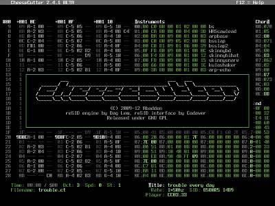
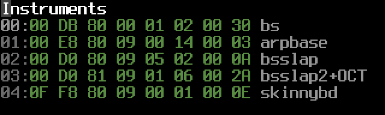
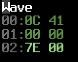
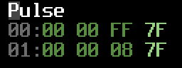
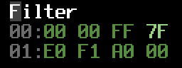
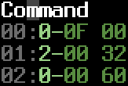
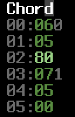

# CheeseCutter-Extended User Guide

This is the consolidated user guide for CheeseCutter-Extended 0.1.0.
CheeseCutter-Extended is based on CheeseCutter 2.9.
The old web-guide screenshots from `origin/dev_docs` are kept in `guide/pics/`.



## Where Help Lives

The live help text shown by <kbd>F12</kbd> is in `src/ui/help.d`.

Context help for player tables is generated from player metadata and rendered by
`src/ui/tables.d`.

Default keyboard bindings are registered in `src/com/shortcuts.d` and connected
to UI actions in `src/ui/ui.d`.

Command-line help is printed by `src/main.d` for `ccutter` and `src/ct2util.d`
for `ct2util`.

Manual pages remain in `doc/*.1`. Extra implementation notes are in `doc/*.md`
when present.

## Quick Start

Open the editor:

```sh
ccutter [OPTION]... [FILE]
```

Useful startup options:

| Option | Meaning |
| --- | --- |
| `-f` | Start fullscreen |
| `-nofp` | Use old reSID instead of reSID-fp |
| `-i` | Disable interpolation |
| `-m 0` / `-m 1` | Select 6581 / 8580 SID model |
| `-n` | NTSC mode |
| `-r <hz>` | Audio sample rate, default 48000 |
| `-b <size>` | Audio buffer size |
| `-fpr <n>` | SID filter preset |
| `-y` | Use YUV video overlay |
| `--height <rows>` | Sequencer height, 32-64 |
| `--width <cols>` | UI width in columns, up to 200 |
| `--autoscale` | Auto-scale UI to the screen |

Export or transform songs with `ct2util`:

```sh
ct2util sid mytune.ct -o mytune.sid
ct2util prg mytune.ct -o mytune.prg
ct2util dump mytune.ct -o mytune.asm
ct2util import base.ct other.ct -o merged.ct
ct2util init player.bin -o new.ct
```

## Menus

The top row is a menu bar. Press <kbd>Esc</kbd> to open it; every command in the
editor (everything except live note entry) is reachable from a dropdown, with its
keyboard shortcut shown on the right of each item.

| Key | Action |
| --- | --- |
| <kbd>Esc</kbd> | Open the menu bar (or close it again) |
| <kbd>←</kbd> / <kbd>→</kbd> | Switch between top-level menus |
| <kbd>↑</kbd> / <kbd>↓</kbd> | Move between items (separators and disabled items are skipped) |
| <kbd>Enter</kbd> | Run the highlighted command |
| <kbd>Space</kbd> | Flip the highlighted on/off command, keeping the menu open |
| Mouse | Click a title to open it; the highlight follows the pointer as you hover items, the pressed item turns yellow, and the command runs when you release the button. Press elsewhere to close. You can also press a title and drag straight onto an item in one motion. |

The menu bar is shown from startup. The fixed menus are **File**, **Edit**,
**View**, **Playback**, **Navigate** (jump between the sequencer, tables and song
info) and **Help**. Before **Help**, context menus appear that follow whatever you
are editing: the F6 note column shows **Note** (note-level commands) and
**Sequence** (sequence-level commands plus the shared sequencer commands); the F5
track column shows **Track** + **Sequence**; the instrument list shows
**Instrument**; the wave/pulse/filter/command/chord tables show **Tables**. The
bar remembers the last menu and item you used, so re-opening with <kbd>Esc</kbd>
returns you to the same place. Hovering an item for a second shows its full
description as a tooltip.

On/off commands (voices, interpolation, keyjam, help texts, fullscreen, tracking)
show their current state with a `[x]` / `[ ]` checkbox in an aligned column; each
item's keyboard shortcut is shown on the right. <kbd>Space</kbd> flips such an
item without closing the menu (handy for switching several voices at once);
<kbd>Enter</kbd> flips it and closes the menu as usual.

The menus are generated from the same shortcut registry that drives the
<kbd>F12</kbd> help and `doc/KEYBOARD.md`, so a command, its label and its shortcut
are defined in exactly one place and can never disagree between them.

## Command Palette

Press <kbd>Esc</kbd> and just start typing: the first printable character turns
the menu bar into a *command palette* — a `>` prompt, VS Code style, that
searches as you type. It is also reachable as **Help → Command palette**.

The palette matches your query case-insensitively against the name and
description of every command reachable from where you are (the global commands
plus the active context's), and against the `.ct`/`.ct2` song files in the
current directory. Better matches sort first (name prefix, then word starts,
then any substring), commands above songs; commands show their keyboard
shortcut on the right and songs a `load` tag.

| Key | Action |
| --- | --- |
| any printable character | Add to the query and refilter |
| <kbd>↑</kbd> / <kbd>↓</kbd> | Move the selection |
| <kbd>Enter</kbd> | Run the selected command, or load the selected song |
| <kbd>Backspace</kbd> | Delete the last character (dismisses when the query is empty) |
| <kbd>Esc</kbd> | Dismiss |
| Mouse | Click a suggestion to run it, click elsewhere to dismiss |

One quirk: <kbd>Space</kbd> cannot be the *first* typed character (in the menu
bar it flips the highlighted on/off item), but it works fine inside a query
(e.g. `play from`).

## Global Shortcuts

| Shortcut | Action |
| --- | --- |
| <kbd>Esc</kbd> | Open the menu bar (see [Menus](#menus)) |
| <kbd>Esc</kbd>, then type | Command palette: search commands and songs (see [Command Palette](#command-palette)) |
| <kbd>Alt</kbd>-<kbd>Return</kbd> | Toggle fullscreen |
| <kbd>F9</kbd> | Load song |
| <kbd>F10</kbd> | Save song |
| <kbd>Shift</kbd>-<kbd>F10</kbd> | Export song (Full player `.prg` / Optimized `.prg` / PSID; options dialog) |
| <kbd>Ctrl</kbd>-<kbd>F10</kbd> | Quick save (no filename prompt) |
| <kbd>F11</kbd> | About dialog |
| <kbd>F12</kbd> | Context help |
| <kbd>F12</kbd> again in context help | Global help |
| <kbd>Ctrl</kbd>-<kbd>F12</kbd> | Screenshot |
| <kbd>Alt</kbd>-<kbd>H</kbd> | Toggle table byte help |
| <kbd>Alt</kbd>-<kbd>F4</kbd> | Quit (asks for confirmation) |

Quit is <kbd>Alt</kbd>-<kbd>F4</kbd>, or open the menu bar with <kbd>Esc</kbd> and
choose **File → Quit**. The confirmation warns when the song has unsaved changes
("You have unsaved changes. Really exit?").

## Load / Save Dialogs

In the load (<kbd>F9</kbd>), save (<kbd>F10</kbd>) and `.prg` export dialogs:

- **Type-ahead**: with the file list focused, just type the beginning of a
  directory or file name — the cursor jumps to the first matching entry
  (case-insensitive). The prefix you typed is shown in the dialog title
  (`find: …`); <kbd>Backspace</kbd> trims it, and it resets after a one-second
  pause so you can start a new search. (In the save dialog the filename field
  has focus by default; <kbd>Tab</kbd> to the file list for type-ahead.)
- **Song preview**: when the focused file is a CheeseCutter song, its
  **Title / Author / Release** are shown above the Directory row, so you can
  identify a tune without loading it.

## Playback

| Shortcut | Action |
| --- | --- |
| <kbd>F1</kbd> | Play from playback mark |
| <kbd>Shift</kbd>-<kbd>F1</kbd> | Play/resume from mark with tracking |
| <kbd>F2</kbd> | Play from start |
| <kbd>Shift</kbd>-<kbd>F2</kbd> | Play/resume from start with tracking |
| <kbd>F3</kbd> | Play from cursor |
| <kbd>F4</kbd> | Stop |
| <kbd>F8</kbd> | Fast forward 5 frames |
| <kbd>Shift</kbd>-<kbd>F8</kbd> | Fast forward 25 frames |
| <kbd>Scroll Lock</kbd> or <kbd>Ctrl</kbd>-<kbd>F5</kbd> | Toggle tracking while playing |
| <kbd>Ctrl</kbd>-<kbd>1</kbd>/<kbd>2</kbd>/<kbd>3</kbd> | Toggle voices |
| <kbd>Ctrl</kbd>-<kbd>F9</kbd> | Cycle playback visualization |
| <kbd>Ctrl</kbd>-<kbd>F2</kbd> | Toggle interpolation |
| <kbd>Ctrl</kbd>-<kbd>F3</kbd> | Toggle SID model |
| <kbd>Ctrl</kbd>-<kbd>F8</kbd> | Next filter preset |
| <kbd>Ctrl</kbd>-<kbd>Shift</kbd>-<kbd>F8</kbd> | Previous filter preset |

## Exporting a song

<kbd>Shift</kbd>-<kbd>F10</kbd> opens the **Export song** dialog. Pick the output
**Format** at the top (cursor on it; <kbd>&lt;</kbd>/<kbd>&gt;</kbd> or
<kbd>←</kbd>/<kbd>→</kbd> cycle), then set the options below; options that don't
apply to the chosen format are greyed and skipped. <kbd>Return</kbd> continues to
the file-save dialog (the **same one used for saving a song** — type-ahead, song
preview, overwrite confirmation); <kbd>Esc</kbd> cancels.

Navigate rows with <kbd>↑</kbd>/<kbd>↓</kbd>; on the selected row,
<kbd>&lt;</kbd> reduces and <kbd>&gt;</kbd> increases the value (toggles flip), and
you can type hex/decimal digits directly.

**Formats:**

- **Full player .prg** — the **current subtune** shipped as the whole editor memory
  image verbatim (the same image used for hardware playback): standalone and
  self-running, but large and unoptimized. Honours the display toggles below.
- **Optimized .prg** — the song purged (unused sequences/instruments/table entries
  removed), relocated and re-assembled, exactly like `ct2util prg`. Far smaller.
- **PSID (.sid)** — a PSID file, exactly like `ct2util sid`.
- **Audio (.wav)** — the selected subtune **rendered to a 48 kHz / 16-bit mono WAV**
  offline through the same reSID engine as live playback (so it matches what you
  hear — SID model, filter, multiplier).
- **Audio (.flac)** — the same render encoded as FLAC. Only offered when the `flac`
  command-line tool is on your PATH (`brew install flac`); otherwise WAV only.

**Options** (each enabled only where it applies):

- **Relocate output to address** — where the player + data is relocated (default
  `$1000`; optimized / PSID only).
- **Relocate zero page** — relocate the player's zero-page usage (`$00` = leave
  default; optimized / PSID only).
- **Export single subtune** — export only one subtune (`all` exports every subtune;
  optimized / PSID only — the full player always uses the current subtune).
- **Set the default subtune** — the PSID start tune (PSID only).
- **Executable (player + UI)** — optimized `.prg` only: when **yes** the file embeds
  the self-running player **and** the on-screen UI (autostart + display), looking
  and playing like the full-player `.prg` but far smaller; when **no** it is just
  the player routine + compacted song data (the blob `ct2util prg` produces), to be
  driven by your own player. (The full player is always executable; PSID never is.)
- **Show title/author/release · Raster-time meter · Playback timer** — opt out of
  the title/author/release rows, the green raster-time border meter, and the
  `Time: MM:SS` clock in the on-screen display (executable `.prg` only).
- **Audio duration (sec)** — render length in seconds (audio formats only; a SID
  tune loops forever, so the export needs a fixed length).
- **Audio fade-out (sec)** — linear fade to silence over the last N seconds
  (0–30, audio formats only) so a fixed-length cut doesn't end abruptly.

## Hardware playback (C64 Ultimate)

Start with `ccutter --ultimate <IP>` to play on a real C64 through a
1541 Ultimate / Ultimate64 over its REST API instead of the built-in reSID
emulation. The player and song are injected once, then edits and play/stop are
mirrored to the machine live; local audio is muted while the editor keeps
following along. Use `--ultimate-port <n>` for a non-default port, and set the
`CHEESECUTTER_ULTIMATE_PASSWORD` environment variable if the device has a network
password (firmware 3.12+).

## Window Navigation

| Shortcut | Action |
| --- | --- |
| <kbd>Tab</kbd> / <kbd>Shift</kbd>-<kbd>Tab</kbd> | Next/previous bottom subwindow |
| <kbd>Ctrl</kbd>-<kbd>Tab</kbd> | Cycle main windows |
| <kbd>Ctrl</kbd>-<kbd>Shift</kbd>-<kbd>Tab</kbd> | Cycle main windows backwards |
| <kbd>Alt</kbd>-<kbd>1</kbd>/<kbd>2</kbd>/<kbd>3</kbd> | Voice 1/2/3 |
| <kbd>Alt</kbd>-<kbd>V</kbd> | Sequencer |
| <kbd>Alt</kbd>-<kbd>4</kbd> or <kbd>Alt</kbd>-<kbd>I</kbd> | Instrument table |
| <kbd>Alt</kbd>-<kbd>5</kbd> or <kbd>Alt</kbd>-<kbd>W</kbd> | Wave table |
| <kbd>Alt</kbd>-<kbd>6</kbd> or <kbd>Alt</kbd>-<kbd>P</kbd> | Pulse table |
| <kbd>Alt</kbd>-<kbd>7</kbd> or <kbd>Alt</kbd>-<kbd>F</kbd> | Filter table |
| <kbd>Alt</kbd>-<kbd>8</kbd> or <kbd>Alt</kbd>-<kbd>M</kbd> | Command table |
| <kbd>Alt</kbd>-<kbd>9</kbd> or <kbd>Alt</kbd>-<kbd>D</kbd> | Chord table |
| <kbd>Alt</kbd>-<kbd>T</kbd> | Song info |

## Sequencer

Use <kbd>F5</kbd>, <kbd>F6</kbd>, and <kbd>F7</kbd> to switch sequencer views:

| Shortcut | Action |
| --- | --- |
| <kbd>F5</kbd> | Track column |
| <kbd>Shift</kbd>-<kbd>F5</kbd> | Hybrid track/sequence view |
| <kbd>F6</kbd> | Note column |
| <kbd>F7</kbd> | Track overview |
| <kbd>Backspace</kbd> | Set playback mark |
| <kbd>Ctrl</kbd>-<kbd>Backspace</kbd> | Set wrap mark |
| <kbd>Ctrl</kbd>-<kbd>Home</kbd> or <kbd>Ctrl</kbd>-<kbd>H</kbd> | Jump to playback mark |
| <kbd>Ctrl</kbd>-<kbd>Z</kbd> | Undo |
| <kbd>Ctrl</kbd>-<kbd>R</kbd> | Redo |
| <kbd>Insert</kbd> / <kbd>Delete</kbd> | Insert/delete |
| <kbd>Shift</kbd>-<kbd>Insert</kbd> / <kbd>Shift</kbd>-<kbd>Delete</kbd> | Insert/delete row |
| <kbd>Ctrl</kbd>-<kbd>Q</kbd>/<kbd>A</kbd> | Transpose semitone up/down |
| <kbd>Ctrl</kbd>-<kbd>W</kbd>/<kbd>S</kbd> | Transpose octave up/down |
| <kbd>Ctrl</kbd>-<kbd>M</kbd>/<kbd>N</kbd> | Increase/decrease row highlight |
| <kbd>Ctrl</kbd>-<kbd>0</kbd> | Reset highlighting to current row |
| <kbd>Ctrl</kbd>-<kbd>E</kbd> | Toggle row counters |
| <kbd>Ctrl</kbd>-<kbd>T</kbd> | Toggle relative notes |
| <kbd>Ctrl</kbd>-<kbd>Space</kbd> | Toggle keyjam |

### Block Selection (copy / cut / paste / merge)

Select a rectangular block — a range of rows across one or more voice columns —
and move it around. It works in both the <kbd>F6</kbd> note column (the block is
note data) and the <kbd>F5</kbd> track column (the block is track-list entries),
and is designed to extend to the player tables later.

Make a selection by **left-dragging** with the mouse, or with the keyboard
markers below. A plain left-click clears the selection and just positions the
cursor. **Paste** and **merge** write into the currently active voice(s) from
the cursor down and are clipped to the current sequence/track end — anything that
would overflow is dropped. **Merge** only fills rows that are currently empty.
**Paste new** instead inserts brand-new track(s)/sequence(s) at the cursor,
sized to hold the block.

While a note-column selection is active, the transpose keys
(<kbd>Ctrl</kbd>-<kbd>Q</kbd>/<kbd>A</kbd> semitone,
<kbd>Ctrl</kbd>-<kbd>W</kbd>/<kbd>S</kbd> octave) apply to every selected note
instead of the default (which transposes from the cursor to the end of the
sequence).

| Shortcut | Action |
| --- | --- |
| Left-drag | Select a block (single or multiple voice columns) |
| <kbd>Ctrl</kbd>-<kbd>B</kbd> | Mark selection start at the cursor |
| <kbd>Ctrl</kbd>-<kbd>Shift</kbd>-<kbd>B</kbd> | Mark selection end at the cursor |
| <kbd>Ctrl</kbd>-<kbd>D</kbd> | Clear the selection |
| <kbd>Ctrl</kbd>-<kbd>C</kbd> | Copy the selected block |
| <kbd>Ctrl</kbd>-<kbd>X</kbd> | Cut (blank the rows, keep the length) |
| <kbd>Ctrl</kbd>-<kbd>V</kbd> | Paste over rows from the cursor (overflow dropped) |
| <kbd>Ctrl</kbd>-<kbd>Shift</kbd>-<kbd>V</kbd> | Merge into empty rows only |
| <kbd>Ctrl</kbd>-<kbd>Shift</kbd>-<kbd>N</kbd> | Paste as new track(s)/sequence(s) |

In the <kbd>F5</kbd> track column, <kbd>Ctrl</kbd>-<kbd>C</kbd>/<kbd>Ctrl</kbd>-<kbd>V</kbd>
fall back to the older count-prompt track copy/paste when no block is selected.

### Track Column

These shortcuts apply in the <kbd>F5</kbd> track column.

| Shortcut | Action |
| --- | --- |
| <kbd>Up</kbd>/<kbd>Down</kbd> | Previous/next track in the active voice |
| <kbd>Page Up</kbd>/<kbd>Page Down</kbd> | Previous/next track in the active voice |
| Hex digits | Edit the transpose/sequence track value |
| <kbd>Ctrl</kbd>-<kbd>F</kbd> | Find next unused sequence number |
| <kbd>&lt;</kbd>/<kbd>&gt;</kbd> | Decrease/increase sequence number |
| <kbd>Ctrl</kbd>-<kbd>Q</kbd>/<kbd>A</kbd> | Transpose active voice tracks from cursor to end up/down |
| <kbd>Insert</kbd> or <kbd>Return</kbd> | Insert a track at the cursor |
| <kbd>Delete</kbd> or <kbd>Backspace</kbd> | Delete the track at the cursor |
| <kbd>Ctrl</kbd>-<kbd>Return</kbd> | Insert a track at the end of the active voice and jump there |
| <kbd>Ctrl</kbd>-<kbd>Insert</kbd>/<kbd>Delete</kbd> | Insert/delete a track at the end of the active voice |
| <kbd>Ctrl</kbd>-<kbd>Shift</kbd>-<kbd>Insert</kbd>/<kbd>Delete</kbd> | Insert/delete a track at the cursor for all voices |
| <kbd>Ctrl</kbd>-<kbd>C</kbd> or <kbd>Alt</kbd>-<kbd>Z</kbd> | Copy tracks to the clipboard after asking for a count |
| <kbd>Ctrl</kbd>-<kbd>V</kbd> | Paste copied tracks after asking for insert/overwrite |
| <kbd>Ctrl</kbd>-<kbd>I</kbd> | Paste copied tracks as insert |
| <kbd>Ctrl</kbd>-<kbd>O</kbd> | Paste copied tracks as overwrite |
| <kbd>Alt</kbd>-<kbd>B</kbd> | Paste copied tracks as insert |
| <kbd>Ctrl</kbd>-<kbd>Alt</kbd>-<kbd>1</kbd>/<kbd>2</kbd>/<kbd>3</kbd> | Swap active voice tracks with voice 1/2/3 |

Note entry uses a piano-style keyboard:

```text
 2 3   5 6 7   9 0
Q W E R T Y U I O P
 S D   G H J
Z X C V B N M
```

<kbd>1</kbd> enters gate off, <kbd>A</kbd> or <kbd>!</kbd> enters gate on,
<kbd>,</kbd> toggles tie, and <kbd>;</kbd> toggles automatic instrument entry.

## Player Tables



Instrument bytes:

| Byte | Meaning |
| --- | --- |
| A/B | ADSR |
| C | Restart type and wave delay |
| D | Hardrestart waveform |
| E | Filter table pointer, `00` means no new filter |
| F | Pulse table pointer, `00` means no new pulse |
| G | Unused |
| H | Wave table pointer |

### Instrument color tags

You can color-code an instrument by putting a `$` tag anywhere in its
description (the text field to the right of the instrument bytes). The digit(s)
after `$` are hex `0`–`F`, the 16 standard C64 palette colors:

| Tag | Effect |
| --- | --- |
| `$X` | Draw the instrument **number** in palette color `X` (foreground only; background unchanged) |
| `$XY` | Foreground color `X` **and** background color `Y` for the instrument number |

The tag recolors the instrument's number both here in the instruments list and
everywhere it appears in the track view, so a sound is easy to spot at a glance.
The first valid `$` tag wins, and a `$` not followed by a hex digit is ignored
(so it stays usable as ordinary text). The tag text itself remains visible in
the description.

The color only **replaces the default gray** — the editing cursor, the
playback/selection highlight and the active-instrument color always override it,
so navigation stays readable. Example: a description of `Lead $E` shows the
`Lead` number in light blue; `Bass $1F` gives a white number on a light-grey
background.



Wave table byte A is transpose/control and byte B is waveform/delay:

| Value | Meaning |
| --- | --- |
| `00-5F` | Relative transpose |
| `80-DF` | Absolute note |
| `7E` | Stop |
| `7F` | Wrap, byte B is target |
| byte B `00` | Keep previous waveform |
| byte B `01-0F` | Override wave delay |
| byte B `10-DF` | SID waveform |
| byte B `E0-EF` | SID waveform `00-0F` |



Pulse table bytes are duration, add value, init value, and jump. Duration
`00-7F` sweeps up; `80-FF` sweeps down. Jump `7F` stops by returning to the
idle row.



Filter table rows follow the pulse-table style. If byte A is at least `80`,
the row initializes filter type, resonance/voice mask, and cutoff. Filter add
values wrap, so `FF` subtracts one.



Command table byte A selects the command, bytes B/C are parameters:

| Command | Meaning |
| --- | --- |
| `0` | Slide up |
| `1` | Slide down |
| `2` | Vibrato |
| `3` | Detune |
| `4` | Set ADSR |
| `5` | Lo-fi vibrato |
| `6` | Set waveform |
| `7` | Portamento |
| `8` | Stop slide/portamento |



Chord values `00-3F` transpose up, `40-7F` transpose down, and `80-FF` wrap.
The first chord set is used as the swing tempo program when song speed is 0 or
1.

## Practical Tips

Keep sequence `00` empty unless you specifically need it; it is commonly used
as a dummy sequence.

Set the playback mark only where voices are aligned. If the view drifts while
editing, <kbd>Ctrl</kbd>-<kbd>L</kbd> centers the active sequencer view.

Use subtunes for working sections, then combine them into the final tune.

Packer treats a subtune as unused if all voices contain a single `A000`
track value.
