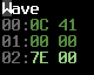
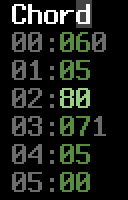

*The Popular Editor*

[README](README.md) | [EDITOR](#Main-help) | [ABOUT](#About) | [CHANGELOG](#News)

# Introduction

This document describes the user interface and functionalities of the CheeseCutter editor.

For editor keyboard shortcut reference, see [#Main-help](#Main-help) or online help in the editor with <kbd>F12</kbd>.

Read more [about](#About) the editor.

# Table of Contents

* General tips
* FAQ
* The default player documentation
  * Tracklist
  * Sequence format
  * Command column values
  * Command table
  * Instrument table
  * Wave table
  * Pulse table
  * Filter table
  * Chord table
  * Miscellaneous
* SID Cheat Sheet
  * Links

## General tips

* Keep sequence `00` empty as it's currently reserved to be used as a dummy sequence. Start your tune from seq `01` and upwards. You can use it too if you insist but it's bound to cause some headache.
* Use subtunes for developing different parts of the tune and combine them to a finished piece in a single tune in the end.
* Make sure you set the playback mark (the blue bar, set with <kbd>Backspace</kbd>) on a location where the tracks are aligned - starting at the same row.
Otherwise the editor will misalign the tracks when starting playback with <kbd>F1</kbd>. If you get yourself into this state, the sequencer can always be reset with <kbd>Ctrl</kbd>-<kbd>L</kbd> which should restore correct alignment.
<kbd>F3</kbd> should work without problems since you can start playback with it from any position, so it's advisable to use it. <kbd>F1</kbd> and mark setting behavior is due to improve in some future version.

I realize the occasional need for resetting could be considered a design flaw. Most JCH-styled editors actually have the same problem, and it's relatively easy to correct by the user so I'm not planning to do much about it soon.

The above applies also to when setting a wrap point (the purple bar, <kbd>Ctrl</kbd>-<kbd>Backspace</kbd>). You should only wrap back to position where tracks are aligned.

* Somewhat related to above - when you start a tune, keep the lengths of your voices aligned, if possible, even if it means you'll be repeating a lot of data (for instance making several 64 row sequences of a bassline with only minor changes). This way you'll have much easier time editing the tune. When your composition is finished, you can start splitting sequences up and eliminate the repetition.
* Packer considers a subtune "unused" if all voices have a single trackvalue of A000 in the tracklist. This is important to know because you might else get unwanted testtunes included with your exported sid.

## FAQ

### How do I convert my tune to .sid?

Use the command line tool (`ct2util`) which came with the zip/tarball. 

Example: 

```
ct2util sid mytune.ct mytune.sid
```

With the JCH compatible version (0.5.x) you're stuck to using the JCH editor's NP-Packer. You can find it in <a href="http://csdb.dk/release/?id=20112">CSDb</a>.

### I can't use the fullscreen / the picture is too small.

Try the YUV video mode (launch ccutter with parameter `-y` or `-ya`).

*The editor drains the battery on my laptop.*

Use the old reSID emulation, and if necessary, drop the sampling rate (commandline parameter `-nofp` for old reSID, and `-r [value]` for sample rate).

### What are the advantages over GoatTracker?

It's mostly a matter of taste. Some (like myself) may find the JCH-like environment more comfortable than GoatTracker's. The player is more rastertime-heavy but I chose features/comfort over speed. There is a tiny 
player in development which is aiming to reduce the rastertime and memory use with the price of some comfort. 

## The default player documentation

**Warning: this doc is slightly inaccurate.**

### Tracklist

First column is the Transpose value of the sequence and the sequence number. 
Second column is the length of the sequence. Third column indicates the overall position in the song, basically 
summing up the sequence lengths.


* Transpose value is now a signed number with value `A0` corresponding zero, `A1` transposing by +1, `9F` transposing by -1 etc.
* Transpose value `80` is a skip value meaning the player will use whatever transpose was previously given in the tracklist.
* The warp point (the purple bar visible in tracklist) can be set with <kbd>Ctrl</kbd>-<kbd>Backspace</kbd> from the editor. It's the point where the song playback returns to when its end is reached.
* The playback start point (the blue bar) can be set with <kbd>Backspace</kbd>. Affects <kbd>F1</kbd>-key.

### Sequence format

Sequences generally look like this:


A single row in a sequence looks like this:


The first column above is obviously the note, second is an instrument value and third is an optional command value.

### Command column values

These are what you can enter into sequences.

* `01-3F` Execute a command from the Command Table (see below for details on possible commands.)
* `40-5F` Changes the pulse table pointer for the currently playing note. Will be overwritten with the default value from the instrument table when the next note comes up (unless the instrument doesn't define a pulse pointer).
* `60-7F` Change the filter table pointer. Works similarily to the pulse table change.
* `80-9F` Activates a "chord" from the Chord Table.

The chord values are read in tandem with the Wave Table (meaning that the wave delay value also affects the chord) and added to the base note. You can apply a chord
over any kind of wave table program except that absolute note values (`80-DF`) are not affected.

The Chord Table is indexed, meaning that the value entered into the Command column does not directly point to the Chord Table but to an index which holds the beginning point of each chord program.
Values `40-7F` are considered negative transpose values, with `7F` equaling to -1, `7E` equaling to -2 etc.

* `A0-AF` Sets the Attack envelope value for the currently playing note.
* `B0-BF` Works similarily for Decay.
* `C0-CF` Works similarily for Sustain.
* `D0-DF` Works similarily for Release.
* `E0-EF` Sets the global volume.
* `F0-FF` Sets the song speed; values 0 or 1 enable the swing tempo. The first set in the Chord Table defines the swing program.

### Command table


Byte A is the command number (see below). Bytes B & C are the parameter values.

* 0 - Slide up
* 1 - Slide down
* 2 - Vibrato. This is the usual delta vibrato as found in JCH's players from 20.G4 upwards. You probably know
how to use it. Try values `2-00 32` and `2-00 43` for starters.
* 3 - Detune the currently playing note. It's a 16 bit value so the whole frequency range is available.
* 4 - Set ADSR for the current note.
* 5 - Lowfi vibrato. Byte A: Speed, byte B: Depth.
* 6 - Set waveform. Byte B: new waveform value. Works only when the current instrumtent's wave program is now changing the waveforms.
* 7 - Portamento. This is a bit tricky to use. Due to current implementation you must activate the portamento BEFORE 
the note(s) you wish to portamento to. Issuing the command in the same row with a note applies the portamento only
on notes following that. ~~(You can use it only on tied notes. When a regular note is encountered the portamento command is shut down. This behavior might be changed in the future.)~~
* 8 - Stop slide or portamento. Does not take any parameters.

### Instrument table


*  Byte A / B: ADSR
*  Byte C: Hardrestart type & Wave program delay value
Works mostly as in NP21.G5.
* Low nibble (`x0-xF`): Wave program delay value.
* `0x`: Note restart type 1: Gate off three frames before next note. Waveform cleared one frame before next note.
* `4x`: Soft restart. Gate off two frames before next note.
* `8x`: Regular hard restart.
Gate off & write hard restart value to ADSR two frames before next note.
The current instrument's byte D is written to waveform register.
* Ax: Laxity restart. Works like 8x except the AD part of the volume envelope is not touched.
Restart types `0x` and `8x` are the ones to use for most of the time.
4x (soft restart) usually works best (least buggy) with big (>= 8) release values.
* Byte D: Hardrestart waveform
Used when Byte C (Hardrestart type) = `8x` or `Ax`. The value is written into SID waveform register 1 frame before next note.
Usually values 0 & 8 are the most useful. The gate bit is automatically set by the player, so it does not make a difference if you type e.g. `00` or `01`.
* Byte E: Filter table program. `00` = no filter; the voice keeps playing any filter program set by another instrument or sequence command.
* Byte F: Pulse table program. `00` = no pulse; the voice keeps playing any pulse program set by another instrument or sequence command.
* Byte G: Unused.
* Byte H: Wave table pointer.

### Wave table



Works mostly like it did in JCH's editor.

* The transpose column (byte A):
  * `00-5F` - Regular transpose values.
  * `80-DF` - Absolute transpose values (unaffected by note or any other transpose value)
  * `7E` - Stop, the wave program stays in the previous row
  * `7F` - Wrap, byte B defines the wrap point
* The waveform column (byte B):
* `00` - Does nothing (keeps the previously set waveform).
* `01-0F` - Overrides the instrument's Wave Delay value for the previous row. Also affects the chord program if one has been enabled. 
* `10-DF` - SID waveform values.
* `E0-EF` - SID waveform values `00-0F`.

### Pulse table


* Duration (byte A). Works like byte C in JCH's players.
* `00-7F` Duration with positive add value.
* `80-FF` Duration with negative add value.
* Add value (byte B). Works like byte B in JCH's players. As previously mentioned, the 7th bit of byte A defines the direction which the pulse sweeps.
* Init value (byte C). Works like byte A in JCH's players. Defines the initial value for the sweep. `FF` uses the previously set value.
* Jump value (byte D). Works somewhat like byte D in JCH's players, except that value 00 always jumps to the following row and value `7F` stops the pulse program execution.

What the "stop" jump value `7F` really does is it just jumps to the row 0 in the pulse table which usually holds the sequence `00 00 FF 7F`, which never changes anything and continously wraps back to itself.

### Filter table


Generally the bytes have same meaning as in pulse table.

* If byte A >= `$80`, then this row is a filter init where byte A sets the filter type, byte B sets the resonance and voice bitmask and byte C sets the initial cutoff.
* Filter sweeps work mostly like the Pulse Table with the exception that add value is always an add, never a subtraction. So add value of `FF` actually subtracts by one, `FE` subtracts by 2 etc. Everyone who knows JCH's players or knows what [two's complement](https://en.wikipedia.org/wiki/Two%27s_complement) means will have no problem understanding how it works.
* Filter sweeps have 10 bit accuracy so they are 4 times as fine as those on JCH players.

#### Example 1
      
<table border="2" cellspacing="0" cellpadding="6" rules="groups" frame="hsides">
<caption></caption>
<colgroup><col align="right" /><col align="left" /><col align="left" /><col align="left" /><col align="left" />
</colgroup>
<tbody>
<tr><td>01:</td><td>90</td><td>F1</td><td>10</td><td>7F</td></tr>
</tbody>
</table>

* Set the Filter type to `$10` (as defined in byte A).
* Set the Filter resonance to `$F` and voice bitmask to 1 (as defined in byte B).
* Set the Filter cutoff to `$10` (as defined in byte C).
* Stop the filter table execution (byte D).

#### Example 2
<table border="2" cellspacing="0" cellpadding="6" rules="groups" frame="hsides">
<caption></caption>
<colgroup><col align="right" /><col align="left" /><col align="left" /><col align="left" /><col align="left" />
</colgroup>
<tbody>
<tr><td>01:</td><td>C0</td><td>07</td><td>FF</td><td>04</td></tr>
</tbody>
</table>

* Set the Filter type to 4 (as defined in byte A).
* Set the Filter resonance to 0 and voice bitmask to 7 - all voices filtered (as defined in byte B).
* Do not init - keep the previous cutoff value (as defined in byte C).
* Jump to row 04 after this row is done (byte D).

#### Example 3
<table border="2" cellspacing="0" cellpadding="6" rules="groups" frame="hsides">
<caption></caption>
<colgroup><col align="right" /><col align="left" /><col align="left" /><col align="left" /><col align="left" />
</colgroup>
<tbody>
<tr><td>01:</td><td>10</td><td>01</td><td>FF</td><td>00</td></tr>
</tbody>
</table>


* Set the duration for this row to `$10` (byte A).
* Set the filter add value to 1 - a really slow upward sweep (byte B).
* Do not init - keep the previous cutoff value (as defined in byte C).
* Jump to the following row when this one is completed (byte D).

### Chord table



* `00-3F` Positive transpose values - e.g. the familiar major chord would be 0-4-7.
* `40-7F` Negative transpose values - 7F = -1, 7E = -2 etc.
* `80-FF` Wrap value.
* The first set in the chord table is used as swing tempo if the song speed is set to 0 or 1.
* The grey number on the right indicates the chord index number.

### Miscellaneous
* The hardrestart ADSR value is read from the first row in the Command Table in bytes B and C. The default value is 0F 00.
* The first set of values in the Chord Table defines the swing tempo program. When you set the speed of your song to 0 or 1 either from the editor or with command Fx, the swing program is enabled.
* Setting a frequency altering command (a slide or vibrato, but not portamento) on a row with tied note causes the command not to be executed. All other command types are usable (portamento included).

* Unfortunately it's not currently possible to change the wavetable pointer of instruments on the fly. That would probably require yet another table for the user to enter wavetable jump points (and editor code to maintain it after wavetable edits).

## SID Cheat Sheet

<table>
<th colspan="5">Voice control register high nybble</th>
<tr><td>Hex</td><td>Noise</td><td>Pulse</td><td>Sawtooth</td><td>Triangle</td></tr>
<tr><td>$0</td><td>&nbsp;</td><td>&nbsp;</td><td>&nbsp;</td><td>&nbsp;</td></tr>
<tr><td>$1</td><td>&nbsp;</td><td>&nbsp;</td><td>&nbsp;</td><td>X</td></tr>
<tr><td>$2</td><td>&nbsp;</td><td>&nbsp;</td><td>X</td><td>&nbsp;</td></tr>
<tr><td>$3</td><td>&nbsp;</td><td>&nbsp;</td><td>X</td><td>X</td></tr>
<tr><td>$4</td><td>&nbsp;</td><td>X</td><td>&nbsp;</td><td>&nbsp;</td></tr>
<tr><td>$5</td><td>&nbsp;</td><td>X</td><td>&nbsp;</td><td>X</td></tr>
<tr><td>$6</td><td>&nbsp;</td><td>X</td><td>X</td><td>&nbsp;</td></tr>
<tr><td>$7</td><td>&nbsp;</td><td>X</td><td>X</td><td>X</td></tr>
<tr><td>$8</td><td>X</td><td>&nbsp;</td><td>&nbsp;</td><td>&nbsp;</td></tr>
<tr><td>$9</td><td>X</td><td>&nbsp;</td><td>&nbsp;</td><td>X</td><td>LOCK</td></tr>
<tr><td>$A</td><td>X</td><td>&nbsp;</td><td>X</td><td>&nbsp;</td><td>LOCK</td></tr>
<tr><td>$B</td><td>X</td><td>&nbsp;</td><td>X</td><td>X</td><td>LOCK</td></tr>
<tr><td>$C</td><td>X</td><td>X</td><td>&nbsp;</td><td>&nbsp;</td><td>LOCK</td></tr>
<tr><td>$D</td><td>X</td><td>X</td><td>&nbsp;</td><td>X</td><td>LOCK</td></tr>
<tr><td>$E</td><td>X</td><td>X</td><td>X</td><td>&nbsp;</td><td>LOCK</td></tr>
<tr><td>$F</td><td>X</td><td>X</td><td>X</td><td>X</td><td>LOCK</td></tr>
</table>

<table>
<th colspan="5">Voice control register low nybble</th>
<tr><td>Hex</td><td>Test</td><td>RingMod</td><td>Sync</td><td>Gate</td></tr>
<tr><td>$0</td><td>&nbsp;</td><td>&nbsp;</td><td>&nbsp;</td><td>&nbsp;</td></tr>
<tr><td>$1</td><td>&nbsp;</td><td>&nbsp;</td><td>&nbsp;</td><td>X</td></tr>
<tr><td>$2</td><td>&nbsp;</td><td>&nbsp;</td><td>X</td><td>&nbsp;</td></tr>
<tr><td>$3</td><td>&nbsp;</td><td>&nbsp;</td><td>X</td><td>X</td></tr>
<tr><td>$4</td><td>&nbsp;</td><td>X</td><td>&nbsp;</td><td>&nbsp;</td></tr>
<tr><td>$5</td><td>&nbsp;</td><td>X</td><td>&nbsp;</td><td>X</td></tr>
<tr><td>$6</td><td>&nbsp;</td><td>X</td><td>X</td><td>&nbsp;</td></tr>
<tr><td>$7</td><td>&nbsp;</td><td>X</td><td>X</td><td>X</td></tr>
<tr><td>$8</td><td>X</td><td>&nbsp;</td><td>&nbsp;</td><td>&nbsp;</td></tr>
<tr><td>$9</td><td>X</td><td>&nbsp;</td><td>&nbsp;</td><td>X</td></tr>
<tr><td>$A</td><td>X</td><td>&nbsp;</td><td>X</td><td>&nbsp;</td></tr>
<tr><td>$B</td><td>X</td><td>&nbsp;</td><td>X</td><td>X</td></tr>
<tr><td>$C</td><td>X</td><td>X</td><td>&nbsp;</td><td>&nbsp;</td></tr>
<tr><td>$D</td><td>X</td><td>X</td><td>&nbsp;</td><td>X</td></tr>
<tr><td>$E</td><td>X</td><td>X</td><td>X</td><td>&nbsp;</td></tr>
<tr><td>$F</td><td>X</td><td>X</td><td>X</td><td>X</td></tr>
</table>

* GATE: Trigger ADSR -curve
* SYNC: Synchronize Channel N with N-1 (1 with 3, 2 with 1, 3 with 2). Sync target frequency should be less than Sync source
* RING MOD: Ring modulate Channel N with N-1 (mixer-effect: fRING = |f1+f2| & |f1-f2|). N-1 shall be Triangle wave
* TEST: Enabling Test bit sets channel output to DC
* Waveforms $9 - $F lock the oscillator (can be reset by enabling test bit)
* Waveforms $3, $6 and $7 are audible only on new SID (8580)

<table><th colspan=4>Transpose table</th><tr>
<td>Hex up</td><td>Hex down</td><td>Note</td><td>Example up/down</td></tr>
<td>00, 0c, 18</td><td>00, 74, 68</td><td>unison</td><td>C - C</td></tr>
<td>01, 0d, 19</td><td>7f, 73, 67</td><td>minor second / semitone</td><td>C - C# / C - H</td></tr>
<td>02, 0e, 1a</td><td>7e, 72, 66</td><td>major second / tone</td><td>C - D / C - Bb</td></tr>
<td>03, 0f, 1b</td><td>7d, 71, 65</td><td>minor 3rd / augmented 2nd</td><td>C - D# / C - A</td></tr>
<td>04, 10, 1c</td><td>7c, 70, 64</td><td>major 3rd / dim 4th</td><td>C - E / C - G#</td></tr>
<td>05, 11, 1d</td><td>7b, 6f, 63</td><td>perfect 4th / augmented 3rd</td><td>C - F / C - G</td></tr>
<td>06, 12, 1e</td><td>7a, 6e, 62</td><td>dim 5th / aug 4th </td><td>C - F# / C - F#</td></tr>
<td>07, 13, 1f</td><td>79, 6d, 61</td><td>perfect 5th / dim 6th</td><td>C - G / C - F</td></tr>
<td>08, 14, 20</td><td>78, 6c, 60</td><td>minor 6th / aug 5th</td><td>C - G# / C - E</td></tr>
<td>09, 15, 21</td><td>77, 6b, 5f</td><td>major 6th / dim 7th</td><td>C - A / C - D#</td></tr>
<td>0a, 16, 22</td><td>76, 6a, 5e</td><td>minor 7th / aug 6th</td><td>C - Bb / C - D</td></tr>
<td>0b, 17, 23</td><td>75, 69, 5d</td><td>major 7th / dim octave</td><td>C - H / C - C#</td></tr>
<td>0c, 18, 24</td><td>74, 68, 5c</td><td>perfect octave / aug 7th</td><td>C - C / C - C</td></tr></table>

<table>
<th colspan="4">Pulse table - durations in frames</th>
<tr><td>direction</td><td>frames</td><td>hex</td><td>ms</td></tr>
<td>Pulse up</td><td>	0</td>	<td>00</td><td>	0</td></tr>
	<td>&nbsp;</td><td>16</td><td>	10</td><td>	320</td></tr>
	<tr><td>&nbsp;</td><td>32</td><td>	20</td><td>	640</td></td></tr>
	<tr><td>&nbsp;</td><td>48</td><td>	30</td><td>	960</td></td></tr>
	<tr><td>&nbsp;</td><td>64</td><td>	40</td><td>	1280</td></td></tr>
	<tr><td>&nbsp;</td><td>80</td><td>	50</td><td>	1600</td></td></tr>
	<tr><td>&nbsp;</td><td>96</td><td>	60</td><td>	1920</td></td></tr>
	<tr><td>&nbsp;</td><td>112	</td><td>70	</td><td>2240</td></td></tr>
<tr><td>Pulse dn</td><td>	128</td><td>	80</td><td>	0</td></tr>
	<tr><td>&nbsp;</td><td>144	</td><td>90</td><td>	320</td></tr>
	<tr><td>&nbsp;</td><td>160	</td><td>A0	</td><td>640</td></tr>
	<tr><td>&nbsp;</td><td>176	</td><td>B0	</td><td>960</td></tr>
	<tr><td>&nbsp;</td><td>192</td><td>C0</td><td>	1280</td></tr>
	<tr><td>&nbsp;</td><td>208	</td><td>D0	</td><td>1600</td></tr>
	<tr><td>&nbsp;</td><td>224	</td><td>E0</td><td>	1920</td></tr>
	<tr><td>&nbsp;</td><td>240	</td><td>F0</td><td>	2240</td></tr></table>

### Links

* [CheatCutter rev.1](https://chordian.net/files/cheesecutter/CheatCutter_Rev001.zip) - a cheat sheet for CheeseCutter (2.8) by Chordian.
* [SID Datasheet](http://www.waitingforfriday.com/index.php/Commodore_SID_6581_Datasheet)
* [SID Registers](http://www.waitingforfriday.com/images/thumb/0/03/SID_Registers.PNG/712px-SID_Registers.PNG)
* [SID Info (aay64)](http://unusedino.de/ec64/technical/aay/c64/sidmain.htm)


*The Popular Editor*

[README](README.md) | [EDITOR](#Main-help) | [ABOUT](#About) | [CHANGELOG](#News)

# Main help

```
Escape (x2).....Quit program
F10.............Open the Load song dialog
F11.............Open the Save song dialog
F9..............Open the About dialog
Ctrl-F11........Quick save song (doesn't ask a filename)
```

## Playback

```
F1..............Play from playback mark
Shift-F1........Play / resume from mark with tracking
F2..............Play from the start
Shift-F2........Play / resume from the start with tracking
F3..............Play from cursor position
F4..............Stop playback
F8..............Fast forward (w/ Shift = Fast forward more)
Scroll Lock.....Start/stop tracking (works only when playing)
Ctrl-1,2,3......Toggle voices on/off
Ctrl-F9.........Show/hide playback info (works only when playing)
```

## Song variables

```
Ctrl-Keypad - +.........Decrease/increase default song speed
[ ] (AltGr-8 / AltGr-9).Decrease/increase default song speed
Alt-Keypad - +..........Decrease/increase multispeed framecall counter 
{ } (AltGr-7 / AltGr-0).Decrease/increase multispeed framecall counter
Ctrl-F3.................Toggle SID type (6581/8580)
Ctrl-F8.................Select next SID filter preset
Ctrl-Shift-F8...........Select previous SID filter preset
Alt-T...................Edit title / author / release info
Ctrl-Alt-C..............Clear sequences (press TWICE to activate)
Ctrl-Alt-O..............Optimize (clear unused sequences & data)
```
## Moving between tables

```
Tab.....................Move cursor between subwindows
Ctrl-Tab................Move cursor between main windows
                        (sequencer, instrument table, subtables)
Alt-V...................Jump to Sequencer
Alt-I...................Jump to Instrument table
Alt-M...................Jump to Cmd table
Alt-P...................Jump to Pulse table
Alt-F...................Jump to Filter table
Alt-D...................Jump to Chord table
Alt-1, 2, 3.............Jump to voice 1, 2 or 3
Alt-4-8 can also move between tables (in the aforementioned order,
so Alt-4 = Sequencer, Alt-5 = Ins, ...)
```

## Instrument table functions

```
Ctrl-L..................Load current insturment from disk
Ctrl-S..................Save current instrument to disk
Ctrl-D..................Delete current instrument
Ctrl-C..................Copy instrument to clipboard
Ctrl-V..................Paste instrument from clipboard
```

## Player reference

Check out the [player reference guide](README.md).

## Sequencer help

### General
```
Alt-1,2,3...............Jump to voice 1, 2 or 3
Tab.....................Move cursor to the next voice
Keypad / *..............Decrease/increase base octave value
Ctrl-Keypad - +.........Decrease/increase default song speed
[ ] (AltGr-8 / AltGr-9).Decrease/increase default song speed
Keypad - +..............Decrease/increase active instrument number
Keypad 1-9..............Set cursor step value (used when entering notes)
Alt-Left/Right..........Activate previous/next subtune
F5......................Enter to the track column
Shift-F5................Display tracks alongside the sequences
F6......................Enter to the note column
F7......................Display tracks only ('overview mode')
Home/End................Move cursor to SEQ start/end OR screen top/bottom
Shift-Home/End..........Move cursor to song start/end
Backspace...............Set playback start mark (the blue bar) to current position
Ctrl-Home/Ctrl-H........Jump to playback mark position (also realigns the voices)
Ctrl-Z..................Undo
Ctrl-R..................Redo
Alt-C...................Ask for a SEQ number and copy contents over current SEQ
Alt-A...................Ask for a SEQ number and insert contents to cursor pos
(Shift-)Insert/Delete...Insert/delete a row (Shift=w/ sequence expand/shrink)
Ctrl-Insert/Delete......Expand/shrink the sequence
Shift-Enter.............Quick expand sequence (expands by highlight value * 4)
Ctrl-Q/A................Transpose semitone up/down
Ctrl-W/S................Transpose octave up/down
Ctrl-M/N................Increase/decrease row highlight value
Ctrl-0(zero)............Reset highlighting to current row
Ctrl-E..................Show/hide row counters for sequences
Ctrl-T..................Toggle notes relative to current transpose
Keypad 0................Play notes for all voices in current row
Ctrl-P..................Split current sequence into two from cursor pos. Use with caution.
```
### In the note column (F6)

```
 2 3   5 6 7   9 0
Q W E R T Y U I O P.....Enter notes (base octave+1)
 S D   G H J
Z X C V B N M...........Enter notes (base octave)
1.......................Enter a gate off (===)
A or !..................Enter a gate on (+++)
Space or '.'............Clear
Space...................Insert previously entered instrument/command value
                        (in instrument/command column only)
- +.....................Decrease/increase base octave
';'.....................Toggle insert instrument value automatically-mode
','.....................Change the note in current row to a tie note
Enter...................Grab the instrument value in the current row
```

### In the track column (F5)

```
Ctrl-F..................Find next unused sequence starting from current value
< >.....................Select previous/next sequence
Ctrl-Q/A................Transpose all tracks up/down from cursor down
Ctrl-C..................Ask for a number and copy the N of tracks into clipboard
Ctrl-V..................Paste copied tracks from the clipboard
Space...................Write the cached sequence number to the track value
Insert/Delete...........Insert empty track (A000) or delete track from cursor
                        pos down
Ctrl-Enter..............Insert a track to end of voice and move cursor there
Ctrl-Insert/Delete......Insert/delete track to end of voice and move cursor there
Ctrl-Shift-Insert/Del...Insert/delete a track for all voices
Ctrl-Alt-1..............Swap voice's track with voice 1's tracks from crsr down
Ctrl-Alt-2..............Swap voice's track with voice 2's tracks from crsr down
Ctrl-Alt-3..............Swap voice's track with voice 3's tracks from crsr down
```


*The Popular Editor*

[README](README.md) | [EDITOR](#Main-help) | [ABOUT](#About) | [CHANGELOG](#News)

# About

CheeseCutter is a tracker program for composing music for the [SID](http://en.wikipedia.org/wiki/MOS_Technology_SID) chip. 
It uses the reSID engine for SID emulation. The packed files can be played on a real C64.

The first release, what I now call the "0-series" was aiming for JCH Editor
compatibility. Most JCH Editor files are compatible with this editor, so there
was a large stock of music already composed "for it", which may have
helped to attract experienced users.

The new "2-series", although similar on the surface, is a totally different beast.
Nearly all parts of the program have been overhauled. JCH
compatibility is gone.  Featurewise it's now pretty close to top of
the line SID music editors such as GoatTracker 2 and Sid Duzz'It.

## Summary of differences between CheeseCutter 0.x and 2.x

* Support for up to 32 subtunes, 48 instruments and 128 sequences.
* Multispeed support.
* Instruments can have descriptions (try pressing <kbd>Enter</kbd> in the instrument table).
* Separate wrap marker and start marker. 
* Sequences have 3 columns instead of 2. This means you can have an instrument setting and a command on the same sequence row. "Tie note" is no longer a command ('***' as it used to be) but is entered in the note column by pressing the note key shifted. Tied notes are displayed in purple background color in the sequencer.
* By default, when you enter a note, the corresponding instrument value is also set in the second column. The active instrument can be selected with <kbd>Keypad +</kbd> and <kbd>Keypad -</kbd>. The selected instrument can be seen highlighted in the instrument table. You can toggle this feature on and off with the semicolon key.
* More sophisticated player/editor integration - closer to SID Factory (though still lacking in features).
* <kbd>F3</kbd> starts playing the song from wherever the cursor happens to be in the sequencer; previously it was only possible to play from the beginning of the tune or the beginning of the sequence.
* Track transposing now uses signed values so you can transpose both in negative and positive direction, with A0 being the center value; this works similarily to SDI. Transpose value 80 uses whatever value was previously set in the track.
* No JCH's editor-style +++ / --- in note column to indicate the gate bit status - uses the modern way of toggling the gate value with separate commands in the note column. 
Works mostly like in GT2. Pressing <kbd>1</kbd> in the note column enters the gate off command; <kbd>!</kbd> or <kbd>a</kbd> enters the gate on command.
* <kbd>Ctrl-T</kbd> in the sequencer allows you to toggle between displaying and editing the notes independent of transpose value, like in JCH's editor, or relative to current transpose value, like in SDI.
* <kbd>Ctrl-R</kbd> in the sequencer allows you to display/hide the individual row counters for sequences.
* The currently used SID model and filter preset (if resid-FP is used) are saved in the song header and restored when you load the tune.
* Song data is packed and with a new recommended file extension (.ct), though not enforced in the program.

## Summary of features in the new player

* Has almost all the features of NP21.B6 (the B stands for booty, by the way), which was based on Laxity's NP21.G5, and dozens more. The downside of this is yet additional memory and rastertime use. To save a couple of bytes and scanlines, you can easily flag out any unused effect code if you're willing to assemble your final tune from a source dump. A tool to pack and dump your worktunes to source code is included in the distribution.
* Many commands accessible directly from a sequence so the *Command table* (or Super Table as it's called in JCH's editor) is not used nearly as much as it used to be. This reduces the amount of extra tinkering.
* The command table is 3 bytes wide instead of 2, with the 1st byte simply denoting the command to be used. (Note that only 4 lowest bits are displayed, e.g. 0-F)
* All filter settings can only be controlled from the filter table. This allows more flexibility but also slightly more work on the user's part.
* As it used to be, the first 2 bytes in the *Command table* are the hard restart values. (the first "value bytes" in the command table that is...). Chord program 0 is used as a swing tempo program when it has been enabled by setting the song speed to 0 or 1. 
* Unfortunately it is not possible to change the wave table pointer from a sequence or the command table. However, the newly added chord table diminishes the need for such feature.

## Known bugs and missing features

### Editor

* Multispeed playback doesn't work well past 4x.
* No drive selection in the file selector.
* Some crashes related to unicode handling. Mostly concerns the file selector, so watch out when you change to a dir with lots of weirdly named files.
* Importing misses some parameters such as the sid model and default subtune speeds. 
* NTSC support incomplete, untested etc. If anyone actually still makes NTSC tunes, let me know. 
* 1024x768 resolution very buggy. (REMOVED since 2.4.0)
* Make sure you set the playback mark on place where the tracks are aligned - starting at the same row. Otherwise the editor will misalign the tracks when starting playback in followplay mode with <kbd>Shift</kbd>-<kbd>F1</kbd>. If you get yourself into this state, the sequencer can always be reset with <kbd>Ctrl</kbd>-<kbd>L</kbd>, which should restore correct alignment. <kbd>F3</kbd> should work without problems since you can start playback with it from any position, so it's advisable to use it. <kbd>F1</kbd> and mark setting behavior is due to improve in some future version.

### Packer

* <b>-s</b> and <b>-c</b> parameters don't actually do anything yet. 
* Perhaps an option to use non-vsynced player timing for finer tempo control. 

### Player

* Issuing a portamento resets an ongoing slide.
* Slide, vibrato &amp; portamento commands can't be started on the same row with a tied note.
* Changing between swing tempo and regular tempo mid-song can mess the timing.

## Screenshots & videos

Screenshot.

[](pics/ccmain.png)

* [Youtube video of CheeseCutter 0.4 playing DRAX's brilliant "Swamp Poo"](http://www.youtube.com/embed/MBpAb0kM-M8)
* [Youtube video of CheeseCutter 0.4 playing Mitch & Dane's "Dazzler"](http://www.youtube.com/embed/w9gUmahnR4Y) (Warning: low quality video)

## Credits

* Programmed by abaddon + contributors in 2009-2013.
* reSID engine by Dag Lem &amp; Antti Lankila.
* Some parts of the reSID interface taken from GoatTracker by Cadaver / CovertBitops.
* Music player based on NP21.G4 by Laxity / Vibrants / MoN.
* Ascii logo by iLKke / pm.
* Special thanks to Vent / Triad, Blackspawn, Scarzix / Offence, Ruk / Triad, Wisdom / Crescent for their assistance; to Cadaver for authoring GoatTracker, Geir &amp; GRG of Shape for authoring SDI, and Laxity and JCH for their editors which were the main sources of inspiration for this program.

The program is licensed under GPL General Public License.


*The Popular Editor*

[README](README.md) | [EDITOR](#Main-help) | [ABOUT](#About) | [CHANGELOG](#News)

# News

**If you're a Facebook user, join the CheeseCutter SID music editor group to hear the latest gossip.**

## Version 2.9

* Added undo/redo (<kbd>Ctrl</kbd>-<kbd>Z</kbd> / <kbd>Ctrl</kbd>-<kbd>R</kbd>) functions for most editing functions in the sequencer.
* Fixed a serious bug in the player which caused song speed to go wrong (Y-register was not properly initialized).
* Position information for each subtune is retained. So as you change to another subtune, the editor jumps back to where you were last time in that subtune.
* Redesigned tracklist copy/paste functionality
        
  * <kbd>Ctrl</kbd>-<kbd>c</kbd> copies to memory
  * <kbd>Ctrl</kbd>-<kbd>v</kbd> pastes; dialog is opened for selecting paste mode (insert or overwrite)
  * <kbd>Ctrl</kbd>-<kbd>o</kbd> pastes overwriting the trackdata (exactly how <kbd>Alt</kbd>-<kbd>B</kbd> works)
  * <kbd>Ctrl</kbd>-<kbd>i</kbd> pastes by inserting to the cursor position

For convenience, old <kbd>Alt</kbd>-<kbd>Z</kbd> & <kbd>Alt</kbd>-<kbd>B</kbd> still work.
    
* Added "sync" support into the player. `F0` command increases counter at a sort-of fixed memory location. removes the possibility to use two chord programs for song speeds.
* Fixed a bug when deleting rows in chord table.
* Fixed crash in fileselector when last file in list had been moved/deleted and cursor was pointing to that file.
* Keyjam: gate is kept on for as long as the key is pressed. gate will be set off once key is released.
* Linux version now distributed as a snap package (64 bit only).
* `CC_HOME` shell variable sets default directory for load and save.

## Version 2.8 (28-11-2015)

* Can insert & delete rows in filter and pulse tables (<kbd>Shift</kbd>-<kbd>Insert</kbd> & <kbd>Shift</kbd>-<kbd>Delete</kbd>)
* Filter and pulse programs used by current instrument are highlighted.
* Window is resizable in YUV mode (no aspect ratio preserved).
* In the sequencer, <kbd>Keypad 0</kbd> plays the current row (all voices) and advances cursor a step down.
* Simple oscilloscope view via <kbd>Ctrl</kbd>-<kbd>F9</kbd> (works only in standard graphics mode).
* Simple instrument saver: Can now save, load and delete instruments with <kbd>Ctrl</kbd>-<kbd>L</kbd>, <kbd>Ctrl</kbd>-<kbd>S</kbd>, <kbd>Ctrl</kbd>-<kbd>D</kbd> when in instrument table. Instruments are saved to disk in a CSV-like format.

* Various confirmation dialogs added, e.g. when trying to overwrite an already existing file.
* Minor fix in 6502 emulation.
* Some checks for illegal values in the worktune during packing.
* Various stability fixes.
* Player changes:

* Improved preview note playback - used to randomly fail on notes with maximum sustain or long attack.

* Direct pulse width values via instrument byte 5:

	* Values `$00-$3F` launch pulse program (as previously)..
	* Values `$80-$8F` will just set the pulse high byte, no pulse program is launched.

* StereoSID version's `-mono` commandline flag disables stereo output.

## Version 2.7 (1-11-2014)

* New packing system. In short: the player is assembled from source up is used instead of byte banging. Allows optimizing unused effect code away, hence smaller (and a tiny bit faster) tunes.
* ct2util can export a single subtune with `-s` switch.
* "keyjam" bugfixed. It's still not perfect. Basically the started note plays until you enter a note off (<kbd>1</kbd> on the keyboard).
Also the header color changes when keyjam enabled to indicate the mode you're in.
* On Mac, keypad <kbd>=</kbd> equals PC's keypad <kbd>+</kbd>
* Lots of other MacOS related fixes from contributors.
* Also released a separate StereoSID version for StereoSID goodness. See d/l page. 

## Version 2.6.1 (13-6-2014) - Never say never.

Quick fix for the scaled full screen mode - the screen should be now centered properly.
Also, all builds were compiled with compiler optimizations enabled, so the program should waste little less CPU cycles.
Also, a possible fix to mac build script. Can't test it since I don't own a mac.

## Version 2.6 (10-5-2014) - The first real stable, hopefully.

The program is now based on the Mac version 2.5.1, which ported the whole source to D2 along with mac specific fixes, hence lots of internal changes. 
Hopefully no new bugs.

### What's new
 
* Third number dropped from version numbering scheme. It might still make occasional appearance if the release includes only small additions or bugfixes.
* Added some keymap translation mainly for laptop and mac use. These are currently not documented in the inbuilt help as it has already gotten pretty bloated.
	* Keypad Enter now works as alternative insert key (why the hell has insert been removed from modern keyboards in the first place?)

* <kbd><</kbd> and <kbd>></kbd> work as octave change in sequencer (<kbd>+</kbd> and <kbd>-</kbd> don't work right on some keymaps and keypad might be inaccessible)
* <kbd>Shift</kbd>-<kbd>up</kbd> / <kbd>Shift</kbd>-<kbd>down</kbd> corresponds to <kbd>Page Up</kbd> and <kbd>Page Down</kbd>, for laptops which have those keys in awkward location.

* "Logo key" (aka Windows/Super/Meta/Cmd-key) works as short for <kbd>Ctrl</kbd>-<kbd>Shift</kbd> keycombos in sequencer. Ie. <kbd>Ctrl</kbd>-<kbd>Shift</kbd>-<kbd>Insert</kbd> (which inserts a track for all voices) can be done
with "logo"-<kbd>Insert</kbd>. "Logo" and <kbd>1</kbd>-<kbd>9</kbd> corresponds to keypad <kbd>1</kbd>-<kbd>9</kbd>. The plan is to map at all keypad functions to "logo" key as alternative.
However, there's no guarantee that all platforms and desktop environments allow programs to use this key freely.

* Simple backup system implemented. Can be disabled with `-nobackup` command line flag.
* Exporting multispeed tunes work right on triple/quadruple/etc tunes.
* Chordtable purging had a bug which caused it to destroy the 1st chord in some cases.
* Using sequence 00 in the song caused ALL seqdata to be dumped into the exported tune. It would still play right but there was plenty of useless data included.
* Player updated to *4.03*. It uses the 7th instrument byte as hard restart SR envelope value.

Also, thanks to everyone who participated in the Release the Cheese competition. The 8 top entries are now included in the example tunes.

## Mac port released

Ruk / Triad has done a great job and ported the latest CC to Mac. Get it from the download page.

## Version 2.5.0 (13-5-2013) - The last beta (or the first stable?)

Plenty of bugfixes here and couple of new features and example tunes. Also, this new shiny web page makes its first appearance. 
The development will be put to rest for a while.

### Brief list of changes:

Editor

* Player specific help integrated into the tables - should make memorizing the meanings of bytes easier. Just press F12 on any table and a help box pops up. <kbd>Alt</kbd>-<kbd>H</kbd> switches this off.
Since the documentation is in the player binary itself, and you happen to use some older player in your tune, the help won't work.
* Aspect correction works right (ie. keeping the 4:3 ratio) on wider screens. You will need to launch the program with parameter *-ya* to enable it.
* Transpose is now always preserved on wrap point on packed tune.
* Packer sets the speed flags correctly when exporting to SID.
* Extra checks for note+trans overflows in the sequencer.
* Note data in sequencer are now by default displayed relative to the current transpose value (you can still get the old behavior with <kbd>Ctrl-T</kbd>).
* Keyjam thingy debugged (<kbd>Ctrl</kbd>-<kbd>Space</kbd>).
* Wrap position marker (purple bar) is actually visible behind the start position marker (blue bar). It looks a bit busy now though.
* Extra keybindings:
   * <kbd>Ctrl</kbd>-<kbd>Alt</kbd>-<kbd>c</kbd> = Clear all sequences.
   * <kbd>Ctrl</kbd>-<kbd>Alt</kbd>-<kbd>o</kbd> = Optimize song data.
* Track data swapping in the track table (<kbd>F5</kbd> or <kbd>F7</kbd> mode) - press <kbd>Ctrl</kbd>-<kbd>Alt</kbd>-<kbd>1</kbd> to swap the current voice's tracks from cursor down with voice 1's tracks. <kbd>Ctrl</kbd>-<kbd>Alt</kbd>-<kbd>2</kbd> swaps with voice 2's, etc. Note that wrap pointers are not updated and it's generally quite easy to mess up your song with this so use some caution.
* Multispeed driver bugfixed and doesn't fuck up the play after the song is restarted (playback counter was previously left uninitialized). Uses one extra ZP byte though.
* ct2util 'import': infs-array overflow error fixed
* 20ms delay before playback is started + cpucall is now never doing PauseAudio - should fix the long standing race condition thingy when calling 6502 emu from another thread.
* More verbose output on some error messages in playback.
* Purging used to cause chordindextable not to be regenerated (some "chords" could be played wrong after purging).
* Fixes to transposed octave input column.
* Some old example tunes imported to the latest player (kalma.ct still uses the old one since it wouldn't sound right with the changes to wave routine).
* Lots of internal stuff improved/rewritten.
* Lots of safety checks for Sequence splitting.
* Packer checks for overflow when relocating.
* Packer checks against the max. no of subtunes correctly when setting default subtune.
* and LOTS MORE.

Player
* Some editor specific code moved to upper memory and will be left out from the exported tune after packing.
* Lo-fi (cmd 5-xx xx) vibrato debugged.
* Wave program optimized and debugged. The player hogs 1-2 lines less (though it's still a piggy, make no mistake&#x2026;)
* Vibrafeel add done BEFORE main freq modulation - lofi-vibrato skips the unnecessary adds.
* Some size optimizations.

## Version 2.4.0 (23-9-2012)
### Editor

* YUV12 video overlay mode (parameter `-y`). Basically allows to use the editor in 
full screen independently of the actual screen resolution used. The YUV scaling can make the font seem a bit distorted. Also it will take more CPU time to draw the screen. The screen aspect ratio is not taken into account (unless you specify parameter -ya) so the program may look funny (funnier that usual&#x2026;) in certain resolutions.
* The allocated screen surface is now 32 bits instead of 8. This because YUV overlays don't work in 8
bits and possibly not in 16 bits either. Might be necessary to use 8 bit surface for regular mode and 32 bits only for YUV mode.
* ct2util: command "init" working now.
* Crucial packer fixes.
* Chord, filter, pulse & cmd tables are now also purged. Whee!
* Instrument & cmd tables are properly packed.
* Dumping to source works much better.
* Exporting multispeed tunes to SID bugfixed.
* Fixes for track deleting. When there are no more tracks to delete, an "empty" track (A000) is inserted.
* 1024x768 mode removed for now.

### Player

* Per-voice freq offsets reintroduced.
* Subtune which uses swingtempo is now initialized properly.
* Swing tempo inited correctly when setting speed from a sequence.
* Portamento logic yet again rewritten. Basically 7-xx xx starts the portamento and it stays on until another frequency altering command (0, 1, 2, 5 or 8) is issued.
* Three extra commands: 
   * 5-xx xx is now a "lo-fi" vibrato with parameter byte A corresponding duration and byte B the depth.
   * 6-xx xx sets the waveform (byte B). It's tricky to use since the wavetable is run continously and overwrites the waveform command unless you are specifically skipping the waveform in your wavetable program (using waveform value 0).
   * 8-xx xx stops any frequency altering command. Mostly useful with portamento (which now runs continously). The parameter bytes are ignored. Note that applying a slide command with value 0 basically does the same thing.

## Version 2.3.2 (29-3-2012)

* Chord number indicator for the chord table.
* A huge load of fixes for track editor, wrapmark handling etc.
* More codebase reorganizing.
* For better or worse, the Windows binaries are now compiled with -O2.

## Version 2.3.1 (24-3-2012)

* Console output on Windows (ct2util)

## Version 2.3.0 (18-3-2012) - First beta!

### Editor

* Major reorganization of the codebase.
* Now using Derelict SDL bindings. The program should finally run natively on MacOS X. The SDL libraries are linked dynamically and might cause problems where used not to be any.
* Can now skip forwards and backwards while in followplay mode (keys <kbd>+</kbd> and <kbd>-</kbd>) (very experimental, expect issues)
* Song data importing from Load File dialog (key <kbd>Shift</kbd>-<kbd>Enter</kbd>). Only the music data is loaded and the player that you currently have in memory is kept. This allows you to i.e. update your tune made with an older player to the current one.
* Sequencer: Lots of improvements to <kbd>F5</kbd> (the track view/editor)
* Instead of being centered, the pointer is "anchored" to top of the screen when browsing up & down like it used to work in 0.x. <kbd>Ctrl</kbd>-<kbd>L</kbd> centers the display.
* <kbd>Shift</kbd>-<kbd>F5</kbd> toggles the "hybrid" view where the following/preceding tracks are also displayed.
* Clear-command (<kbd>Alt</kbd>-<kbd>Keypad 0</kbd>) clears subtunes as well.

### Packer
* **ct2pack** replaced with **ct2util** which includes a few extra commands for song manipulation, besides packing.
* Song relocating implemented. When exporting to a SID-file, multispeed tunes cannot be relocated, or rather, the code
for playing the extra frames can't be relocated. There shouldn't be any need to relocate songs inside SID-files anyway.
* Dumping song data to acme source code implemented (BETA - instrument tables are not packed but dumped entirely).
* Importing (same as <kbd>Shift</kbd>-<kbd>Enter</kbd> in fileselector)

## Version 2.2.6 (2-3-2012)
* Added a simple mouse support: Tables and voices can be activated and the cursor moved to the desired spot with a mouse click. Mouse wheel acts similarly to pressing cursor up or down on the activated window. Some elements on the screen are clickable as well: 
  * Title
  * Playback multiplier (left button decreases the value, right increases)
  * SID Model & Filter preset (left button toggles the model, right button changes the preset)
* Inactive voices are properly shut down when entering notes.
* Caps lock also enables/disables keyjam.
* Entered notes are always played on the voice the cursor is currently on.
* Playback position is displayed in trackmap (<kbd>F7</kbd>).
* Song purging (<kbd>Alt</kbd>-<kbd>Keypad Del</kbd>) actually works: Unused sequences and instruments are removed & wave- and chord tables are cleaned. Also, sequences are checked against duplicates (ie. their length and data is identical) and removed if necessary.
* Doesn't crash when trying to load a non-editor file.
* Lots of internal rewrites. New bugs may have been introduced.
* Sequencer: <kbd>Ctrl</kbd>-<kbd>G</kbd> "grabs" the instrument value in the current row.
* <kbd>Enter</kbd> jumps between track and sequence editing (like <kbd>F5</kbd> does).
* Default audio frequency 48000hz instead of 44100hz.

## Version 2.2.5 (19-2-2012)

### Player 
* Portamento logic changed: it's not affected by set instrument command anymore. This causes portamento to 'regular' (not tied) notes not to work :/ 

### Sequencer
* When entering notes, the note on currently activated instrument gets played (on 1st voice only though).

## Version 2.2.4 (15-2-2012)

* 1st version of the keyjam mode (<kbd>Ctrl</kbd>-<kbd>Space</kbd>). All editing functions disabled during keyjam. 

## Version 2.2.3 (11-2-2012)

* Packer now supports subtunes. 
* Clock counter sometimes overwrapped when changing multiplier during play.

## Version 2.2.2 (9-2-2012)

* Sequencer: instrument values not autoinserted when entering tied notes.
* Message displayed when autoinsert mode gets toggled (with key <kbd>;</kbd>)
* Key <kbd>.</kbd> in wave table clears the row and moves cursor one row down.
* Extra keys: <kbd>[</kbd> and <kbd>]</kbd> for speed change; <kbd>{</kbd> and <kbd>}</kbd> for multiplier change.
* Some crucial packer bugfixes.

## Version 2.2.1 (7-2-2012)

* Followplay bugfixes: doesn't get out of sync when tracking songs with swingtempos. Should not screw up anymore when fastforwarding over a song speed change command.
* Wrapmark also displayed in <kbd>F7</kbd>.

## Version 2.2.0 (6-2-2012)

* New wrapmark logic: the value is stored with the track end indicator byte in he tracklist.
* Editor updated to display a marker for wrap mark position (the brown bar). 
* Song playback always wraps to this point independent of the method the playback was started with (using keys <kbd>F1</kbd>, <kbd>F2</kbd> or <kbd>F3</kbd>) <kbd>Ctrl</kbd>-<kbd>Backspace</kbd> in the sequencer sets the wrapmark.
* Revised packer: attaches custom player for multispeed tunes on SID export. 
* Player: filter sweeps use 10 bit resolution instead of 11.
* Default song speeds stored for each subtune now.
* "Context help" implemented: <kbd>F12</kbd> displays its own help screen for the Sequencer.
Pressing <kbd>F12</kbd> twice displays the global help screen.

## Version 2.1.0 (1-2-2012)

* Swing speeds are read from the chord table.
* Resid-fp is now used as default (`-nofp` uses old resid instead).
### Sequencer
* <kbd>F5</kbd> (track view) also displays the tracklist. The display is centered.
* v0.5 docs removed.
* First alpha version of the commandline song packer.
* All info strings editable with <kbd>Alt</kbd>-<kbd>T</kbd>.
* Default audiobuffer size 2048 instead of 1024.
* Help texts brought up to date.

## Version 2.0.0 (9-12-2011)
* Can navigate between sequencer and tables using <kbd>Ctrl</kbd>-<kbd>Tab</kbd>.
* Copy & paste functions for instrument table (<kbd>Ctrl</kbd>-<kbd>C</kbd> / <kbd>Ctrl</kbd>-<kbd>V</kbd>).
